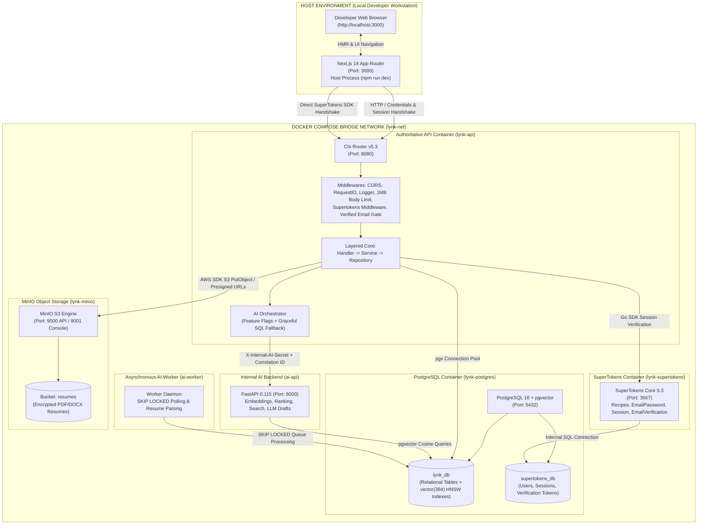
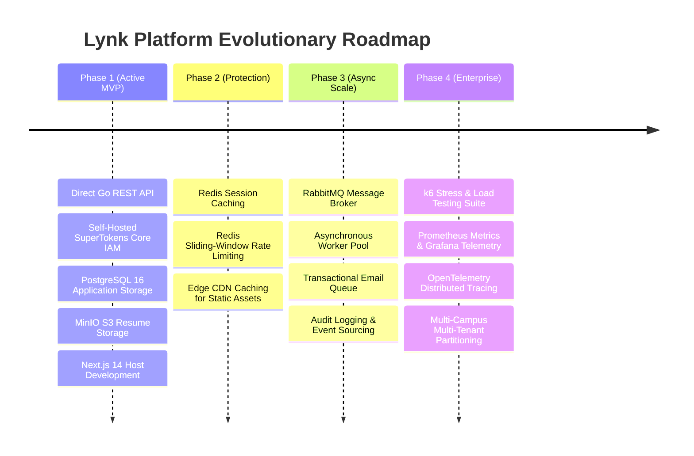

<div align="center">

# Lynk Technical Documentation Hub

**Architecture, specifications, and runbooks for the Lynk campus work platform.**

<p align="center">
  <a href="https://github.com/BIJJUDAMA/Lynk/actions/workflows/ci.yml"></a>
  <a href="https://github.com/BIJJUDAMA/Lynk/actions/workflows/smoke-test.yml"></a>
  <a href="https://github.com/BIJJUDAMA/Lynk/actions/workflows/docker-build.yml"></a>
  
  
  
</p>

</div>

---

## 1. Executive Summary & Core Thesis

**Lynk** is an institutional campus work platform connecting verified university students with projects, deliverable agreements, and peer reviews. Operating as a discovery-first network without payment handling, Lynk facilitates peer collaboration, deliverable agreements, and verified reputation building.

Traditional platforms fail campus ecosystems because they:
1. Impose financial payment processing overhead and commercial transaction friction on academic and peer collaborations.
2. Segregate participants into rigid, adversarial "employer" and "freelancer" account silos.
3. Lack institutional identity verification, exposing students to identity fraud and unverified external actors.
4. Fail to capture academic context (departments, majors, graduation cohorts, and campus reputation).

### The Unified Campus Member Model
Lynk completely replaces the fragmented dual-account paradigm with the **Unified Campus Member** model:
- **Single Identity, Dual Capabilities:** Every authenticated member in the platform possesses a single account backed by a mandatory institutional `.edu` email address.
- **Fluid Role Switching:** Any member can simultaneously post opportunities (as an organizer/poster) and apply to opportunities (as a contributor/student).
- **Academic Context:** Profiles feature major, department, graduation year, verified skills, and campus club affiliations alongside professional portfolios.
- **Trust Through Invariants:** Opportunities and proposals are backed by deliverable collaboration contracts, strict relational constraints, and peer reviews tied to completed contracts.

```
       +-------------------------------------------------------------+
       |               Unified Campus Member Identity                |
       |             Verified institutional .edu Account             |
       +-------------------------------------------------------------+
                       /                             \
                      /                               \
                     v                                 v
        [ Organizer / Poster ]              [ Contributor / Student ]
        - Create opportunity postings       - Browse campus opportunities
        - Review proposals                  - Submit applications
        - Coordinate & execute contracts    - Upload verified resume
        - Review student deliverable        - Receive peer rating & review
```

---

## 2. 30-Second Technical Orientation

| Dimension | Specification | Notes & Invariants |
| :--- | :--- | :--- |
| **Monorepo Topology** | Polyglot monorepo (`frontend/`, `backend/`, `ai/`, `docs/`) | Co-located frontend, authoritative backend, and internal AI subsystems. |
| **Frontend Stack** | Next.js 14.2 (App Router), React 18.3, TypeScript 5.6, Tailwind CSS 3.4 | **Runs on host (`npm run dev`) at `http://localhost:3000`**. NOT dockerised for instant HMR. |
| **Frontend Auth Client** | `supertokens-web-js` 0.16.0 | Handles session tokens (`sAccessToken`, `sRefreshToken`), direct login, and email verification. |
| **Authoritative Backend** | Go 1.25, Chi Router v5.3, `pgx/v5` 5.5, AWS SDK Go v2 (S3) | **Dockerised (`lynk-api`) at `http://localhost:8080`**. Layered architecture: Handler -> Service -> Repository. |
| **AI Backend (Internal)** | Python 3.11, FastAPI, PyTorch, sentence-transformers, scikit-learn | **Dockerised (`ai-api`) at `http://ai-api:8000`**. Protected via `X-Internal-AI-Secret`. |
| **AI Worker Daemon** | Python 3.11 (`ai-worker`) | Background worker consuming `ai_jobs` using PostgreSQL `FOR UPDATE SKIP LOCKED`. |
| **Database** | PostgreSQL 16 (`pgvector/pgvector:pg16` on port `5432`) | Two logical databases: `lynk_db` (relational schema + `vector(384)`) and `supertokens_db`. |
| **Migrations** | Raw sequential SQL (`backend/migrations/000001` - `000013`) | Forward and rollback migrations. Migration 000013 installs domain check constraints. |
| **Identity & Access (IAM)** | Self-hosted SuperTokens Core 9.3 (`lynk-supertokens` on port `3567`) | Recipes: `EmailPassword`, `Session`, `EmailVerification`. Direct HTTP integration with Go API. |
| **Object Storage** | MinIO S3 (`lynk-minio` on port `9000` API, `9001` Web Console) | Dedicated exclusively to the `resumes` bucket. Stores PDF/DOCX resumes with pre-signed retrieval URLs. |
| **Local Network** | Docker Compose bridge network (`lynk-net`) | Internal container DNS: `postgres:5432`, `supertokens:3567`, `minio:9000`, `api:8080`, `ai-api:8000`. |
| **Scope & Boundaries** | Go backend is authoritative; AI is enhancement | Full graceful degradation: Go handlers fall back to SQL if the AI backend is unreachable. |

---

## 3. High-Level Monorepo Topology & Container Boundary

The platform strictly isolates containerized backend infrastructure from the host development environment to preserve rapid local UI iteration while guaranteeing production-grade container parity for services.



---

## 4. Complete Documentation Sitemap

The documentation suite is structured into dedicated modular domains under [`architecture/`](architecture/) and [`development/`](development/). Every specification is authoritative, fully typed, and verified against the production codebase.

| Document | Relative Path | Core Subject Matter | Primary Target Audience |
| :--- | :--- | :--- | :--- |
| **Platform Features & Capabilities Specification** | [`features.md`](features.md) | Exhaustive breakdown of all platform features, capabilities, Unified Campus Member model, zero-payment peer discovery, role access control matrix, and user journey workflows. | Product Managers, All Engineers, Stakeholders |
| **System Architecture & Monorepo Topology** | [`architecture/system-architecture.md`](architecture/system-architecture.md) | High-level system topology, container boundaries, layered Go architecture, dynamic socket timeouts, evolutionary roadmap (Phases 1-4). | All Engineers, Architects, Technical Leads |
| **Database Schema, Relational Constraints & ERD** | [`architecture/database-schema-erd.md`](architecture/database-schema-erd.md) | Mermaid ERD, table-by-table column specs, foreign keys (`ON DELETE RESTRICT`), indexes, state machines, lock ordering discipline, migration registry (000001-000013). | Backend Engineers, Database Admins, System Architects |
| **Complete REST API Specifications** | [`architecture/api-specifications.md`](architecture/api-specifications.md) | Exhaustive documentation of all 24 HTTP endpoints across 6 domains: Auth, Profile, Jobs, Applications, Contracts, Reviews. Status codes, request/response JSON schemas, and error shapes. | Frontend Engineers, Backend Engineers, Integrators |
| **OpenAPI 3.1.0 Contract** | [`architecture/openapi.yaml`](architecture/openapi.yaml) | Machine-readable OpenAPI 3.1.0 specification defining components, schemas, parameters, security schemes (`sessionCookie`, `bearerAuth`), and response envelopes. | API Tooling, Frontend Codegen, QA Engineers |
| **Security, Threat Model & IAM Architecture** | [`architecture/security-and-iam.md`](architecture/security-and-iam.md) | Self-hosted SuperTokens Core configuration, institutional `.edu` email gate, CORS/CSRF defenses, 1MB body limit DoS prevention, dynamic socket timeouts (F-05), password hashing, and threat mitigation. | Security Auditors, DevOps, Backend Engineers |
| **Object Storage Architecture & MinIO Policies** | [`architecture/object-storage.md`](architecture/object-storage.md) | MinIO S3 bucket configuration (`resumes`), bucket isolation, streaming uploads, MIME type validation (`application/pdf`, `msword`), pre-signed download URLs, and storage security. | Cloud Engineers, Backend Engineers, DevOps |
| **Operations, Runbook & Local Developer Guide** | [`development/runbook-and-operations.md`](development/runbook-and-operations.md) | First-time setup, Docker Compose lifecycle, environment variable matrices, database seed scripts, troubleshooting runbook, disaster recovery, and operational procedures. | All Developers, DevOps, Site Reliability Engineers |
| **Testing, Quality Assurance & Verification Strategy** | [`development/testing-strategy.md`](development/testing-strategy.md) | Testing pyramid (unit, integration, HTTP handler, frontend), test execution commands, coverage targets, CI/CD pipeline specifications, and pre-release gates. | QA Engineers, Backend Engineers, Frontend Engineers |
| **Permanent Tooling Architecture & CI Strategy** | [`TOOLING.md`](TOOLING.md) | Universal multi-language linting, formatting, type checking, security scanning, pre-commit boundaries, and parallel GitHub Actions matrix across Go, Python, and TypeScript. | All Developers, DevOps, Platform Engineers |

---

## 5. Persona-Based Reading Guides

To accelerate onboarding, follow the tailored reading paths based on your primary engineering focus.

### 5.1 For Backend Engineers
*Stack: Go 1.25, Chi v5.3, PostgreSQL 16 (`pgx/v5`), SuperTokens Core Go SDK, MinIO AWS S3 SDK v2.*

1. **System Foundation:** Begin with [`architecture/system-architecture.md`](architecture/system-architecture.md) to understand the layered execution model (`Handler` -> `Service` -> `Repository`), dependency injection in `backend/cmd/api/main.go`, and internal networking.
2. **Data & Migrations:** Read [`architecture/database-schema-erd.md`](architecture/database-schema-erd.md) thoroughly. Pay careful attention to:
   - Migration `000003`: The transition of `id` and `user_id` to `VARCHAR(64)` for SuperTokens compatibility.
   - Migration `000009`: Enforcement of `ON DELETE RESTRICT` on `applications.job_id` preventing dangling application states.
   - State transition invariants: Contract status transitions (`Draft` -> `Active` -> `Completed` | `Cancelled`) and the lock ordering discipline (`jobs -> applications -> contracts`) to prevent deadlocks.
3. **API Implementation:** Inspect [`architecture/api-specifications.md`](architecture/api-specifications.md) to verify expected route handlers, input validation constraints, and standardized JSON error structures (`{"error": "string"}`).
4. **Storage & Resumes:** Review [`architecture/object-storage.md`](architecture/object-storage.md) for MinIO S3 integration patterns, streaming multipart uploads, and bucket readiness probes.
5. **Local Workflow & Testing:** Use [`development/runbook-and-operations.md`](development/runbook-and-operations.md) for environment configuration and [`development/testing-strategy.md`](development/testing-strategy.md) for running `go test -v -race ./...`.

### 5.2 For Frontend Engineers
*Stack: Next.js 14 (App Router), React 18, TypeScript 5, Tailwind CSS, SuperTokens Web JS.*

1. **Orientation & Architecture:** Start with [`architecture/system-architecture.md`](architecture/system-architecture.md) to review runtime boundaries (Next.js executes directly on the host machine at `http://localhost:3000` while proxying API calls to `http://localhost:8080`).
2. **Authentication Flow:** Read the IAM and Session section in [`architecture/security-and-iam.md`](architecture/security-and-iam.md):
   - SuperTokens Web JS session initialization (`supertokens-web-js`).
   - Session cookies (`sAccessToken`, `sRefreshToken`) transmitted with `credentials: "include"`.
   - The Institutional Email Gate: Handling `403 Forbidden` responses when an unverified student attempts restricted marketplace actions.
3. **API Contract & Typing:** Consult [`architecture/api-specifications.md`](architecture/api-specifications.md) and [`architecture/openapi.yaml`](architecture/openapi.yaml). Ensure TypeScript types in `frontend/src/types/` exactly match Go struct JSON tags.
4. **Resume Uploads:** Understand the multipart form data requirements (`multipart/form-data`, file key `resume`, 5MB limit, PDF/DOCX only) defined in [`architecture/object-storage.md`](architecture/object-storage.md).
5. **Testing & Validation:** Review frontend test procedures (`tsc --noEmit`, `npm run lint`, node test runners) in [`development/testing-strategy.md`](development/testing-strategy.md).

### 5.3 For Security Auditors & DevOps Engineers
*Stack: Docker Compose, Network Security, IAM, Content Protection, Linux Hardening.*

1. **Security & Threat Model:** Prioritize [`architecture/security-and-iam.md`](architecture/security-and-iam.md). Key inspection areas:
   - Self-hosted SuperTokens Core credential handling and token rotation.
   - Institutional `.edu` domain verification enforcement in Go middleware (`RequireVerifiedEmail()`).
   - Request body limit protection: 1MB limit on JSON payloads preventing OOM exhaustion attacks (F-09).
   - TCP Socket Timeout configuration (F-05): Read/Write socket timeouts (95s/100s) comfortably exceeding application context deadlines (90s dynamic timeout for resume uploads) to eliminate connection drops.
   - CORS isolation: Strict origin whitelisting (`http://localhost:3000`).
   - Internal AI Security: Defense-in-depth `X-Internal-AI-Secret` header validation and correlation ID tracing.
2. **Object Storage Hardening:** Inspect [`architecture/object-storage.md`](architecture/object-storage.md) for MinIO private bucket policies, S3 signature v4 validation, and pre-signed URL expiration.
3. **Relational Data Integrity:** Review [`architecture/database-schema-erd.md`](architecture/database-schema-erd.md) for cascade policies, check constraints, and migration immutability (000001 - 000012).
4. **Operations & Runbook:** Review [`development/runbook-and-operations.md`](development/runbook-and-operations.md) for container health checks, secret hygiene (`SUPERTOKENS_API_KEY`, `MINIO_ROOT_PASSWORD`, `INTERNAL_AI_SECRET`), and database backup/restore procedures.

### 5.4 For AI & Machine Learning Engineers
*Stack: Python 3.11, FastAPI, PyTorch, sentence-transformers, pgvector, scikit-learn, vLLM.*

1. **AI Subsystem Core:** Read Section 7 below and [`docs/superpowers/plans/2026-09-12-first-class-ai-system.md`](superpowers/plans/2026-09-12-first-class-ai-system.md).
2. **Pipelines & Models:**
   - Embedding Provider (`ai/models/embeddings/provider.py`): Centralized `all-MiniLM-L6-v2` generating 384-dimensional dense vectors with SHA-256 content hashing.
   - Canonical Skill Taxonomy (`ai/pipelines/skills/normalizer.py`): Multi-stage normalization (exact alias -> fuzzy Levenshtein -> cosine similarity -> fallback).
   - Hybrid Search (`ai/pipelines/search/hybrid.py`): Reciprocal Rank Fusion blending full-text `@@`, skill tags, and pgvector cosine distance (`<=>`).
   - Advisory Ranking (`ai/pipelines/ranking/ranker.py`): Fairness-compliant candidate ranking (45% skills, 35% semantics, 20% department) strictly excluding demographic attributes.
   - Generative Drafts (`ai/llm/client.py`): Structured vLLM client abstraction with temperature backoff (0.2 -> 0.0) and offline fallback.
3. **Asynchronous Workers:** Inspect `ai/workers/worker.py` for PostgreSQL `FOR UPDATE SKIP LOCKED` concurrency, exponential backoff retries (`retry_at`), and dead-letter queuing.
4. **Evaluation Benchmarks:** Explore `ai/evaluation/` for offline information retrieval metrics (NDCG@K, MRR, Precision@K, F1) and automated benchmark suites.
5. **Testing Suite:** Run `python -m pytest ai/tests/ -v` (100 unit, pipeline, worker, and evaluation tests).

---

## 6. Core Architectural Invariants & Non-Negotiables

Every engineer and agent working within this repository must uphold these non-negotiable invariants:

### Invariant 1: Authoritative Go Backend Boundary
The Go REST API is the sole authority for authentication, authorization, business logic, domain validation, and transactional database state transitions. The internal FastAPI backend (`ai-api:8000`) is strictly an internal compute engine and must NEVER bypass Go authentication or directly alter authoritative domain status columns (`jobs.status`, `applications.status`, `contracts.status`).

### Invariant 2: The Containerization Boundary
- **Backend Infrastructure:** The Go REST API (`backend/Dockerfile`), FastAPI AI Backend (`ai/Dockerfile`), AI Worker, PostgreSQL + pgvector, SuperTokens Core, and MinIO run inside Docker containers orchestrated via `docker-compose.yml`.
- **Frontend Development:** The Next.js application (`frontend/`) must **NOT** be dockerised during development. It runs on the host machine (`npm run dev`) for instant Hot Module Replacement (HMR).

### Invariant 3: Defense-in-Depth Internal AI Security
All internal AI routes on `ai-api:8000` require the `X-Internal-AI-Secret` header. The AI service operates exclusively on the internal `lynk-net` bridge network and is never exposed directly to client browsers or the public internet.

### Invariant 4: Graceful Degradation Everywhere
AI is an enhancement layer. If the AI backend, GPU, or model server is offline, times out, or fails, the Go orchestrator catches the error and seamlessly falls back to deterministic SQL or heuristic logic with HTTP 200. Core campus operations never break due to AI subsystem outages.

### Invariant 5: Authoritative Non-Mutation
Generative AI endpoints (such as `POST /api/v1/jobs/generate`) produce transient draft payloads and NEVER insert rows directly into the authoritative `jobs` table. Campus organizers retain full editorial control before manually publishing.

### Invariant 6: The Institutional Email Gate
Students and campus members cannot post opportunities, submit applications, accept contracts, generate AI drafts, or upload resumes until their institutional `.edu` email address has been verified. The Go API enforces this check via `middleware.RequireVerifiedEmail()`.

### Invariant 7: Resume Object Storage Exclusivity
Resumes are stored exclusively in **MinIO** (`resumes` bucket). The PostgreSQL database stores only metadata (object key, file name, MIME type, byte size, upload timestamp). Binary blobs are strictly forbidden in PostgreSQL.

### Invariant 8: Database Migration Immutability
Never modify an existing raw SQL migration in `backend/migrations/` that has already been executed. Always write an incremental forward migration (`NNNNNN_name.up.sql`) paired with a rollback migration (`NNNNNN_name.down.sql`). Migration `000012` introduces `pgvector` and 12 AI subsystem tables.

---

## 7. First-Class AI Subsystem Architecture & Integration

The Lynk AI subsystem is deeply integrated as an internal first-class platform capability rather than a disconnected set of external APIs.

```text
Host: Next.js (Port: 3000)
  |
  +--> Public API Calls (e.g. GET /api/v1/search/jobs, POST /api/v1/jobs/generate)
  |
  v
Docker: Go REST API (:8080)
  |  Enforces: Session Auth, RBAC, Verified .edu Gate, Rate Limits
  |  Orchestrator: Bounded Retries, Jitter, Feature Flags, Graceful SQL Fallback
  |
  +--> SuperTokens Core (:3567)  [Session Verification]
  +--> MinIO S3 (:9000)          [Resumes Bucket]
  |
  +--> FastAPI AI Backend (:8000 internal) via X-Internal-AI-Secret
  |       +-- EmbeddingProvider: all-MiniLM-L6-v2 (384-dim dense vectors)
  |       +-- SkillNormalizer: Exact alias -> Fuzzy Levenshtein -> Cosine embedding
  |       +-- HybridSearch: pgvector cosine (<=>) + full-text (@@) + RRF
  |       +-- RecommendationEngine: Skill co-occurrence graph + completeness advice
  |       +-- CandidateRanker: Fair observable scoring (skills, semantics, dept)
  |       +-- ModerationDetector: Near-duplicate job vectors + posting velocity
  |       +-- ReviewAnalyzer: Technical, timeliness, and communication aspects
  |       +-- DemandForecaster: Statistical linear trend + moving average
  |       +-- VLLMClient: Versioned prompt job-draft-v1 + temperature backoff
  |       +-- RunTracker: ai_runs audit logging with latency and content hashes
  |
  +--> PostgreSQL 16 + pgvector (:5432)
          +-- Transactional Application Data (users, profiles, jobs, contracts)
          +-- Vector Storage (ai_embeddings with HNSW index)
          +-- AI Logs & State (ai_runs, ai_recommendations, application_ai_scores)
          +-- Asynchronous Job Queue (ai_jobs table with SKIP LOCKED)
                  ^
                  |  Worker Loop (Polling + Exponential Backoff)
                  |
          Asynchronous AI Worker (ai-worker container)
                  +-- EmbeddingJobHandler (Bulk entity embeddings)
                  +-- ResumeJobHandler (Resume skill extraction & tagging)
```

---

## 8. Operational Quick Reference & Command Cheat Sheet

### 8.1 Infrastructure Management
```bash
# Start all backend containers (PostgreSQL, SuperTokens, MinIO, Go API, AI API, AI Worker)
docker compose up -d

# Verify container health status (all containers should show healthy)
docker compose ps

# View unified container logs
docker compose logs -f

# Stop container infrastructure
docker compose down
```

### 8.2 Running Application Processes
```bash
# Terminal 1 (Host Frontend):
cd frontend
npm install
npm run dev
# Frontend runs at: http://localhost:3000

# Terminal 2 (Optional: Direct Host Go API for debugging):
cd backend
go run cmd/api/main.go
# Go API runs at: http://localhost:8080

# Terminal 3 (Optional: Direct Host AI Backend for debugging):
cd ai
uvicorn app.main:app --host 0.0.0.0 --port 8000 --reload
# AI Backend runs at: http://localhost:8000
```

### 8.3 Health Check Verification Probes
```bash
# Deep health check probe (evaluates PostgreSQL connection pool + MinIO bucket status)
curl -i http://localhost:8080/health

# SuperTokens Core health check
curl -i http://localhost:3567/hello

# MinIO S3 live probe
curl -i http://localhost:9000/minio/health/live

# FastAPI AI Backend health & ready probes
curl -i http://localhost:8000/health
curl -i http://localhost:8000/ready
```

### 8.4 Verification & Quality Assurance Suite
```bash
# Backend unit & integration test suite (with race detector)
cd backend
go test -v -race ./...

# Python AI subsystem test suite (115 unit, pipeline, worker, and evaluation tests)
python -m pytest ai/tests/ -v

# Offline IR evaluation suite (NDCG@K, MRR, Precision@K, F1)
python -m ai.evaluation.harness

# Frontend typecheck, linting & test suite
cd frontend
npm run lint
npm test
npx tsc --noEmit
npm run build

# End-to-end multi-container smoke test suite (14 complete phases)
./scripts/smoke-test.sh          # Linux / macOS
.\scripts\smoke-test.ps1         # Windows PowerShell
```

### 8.5 Automated GitHub Actions CI/CD Pipelines
The repository enforces code quality and deployment safety across decoupled workflows:
- **Core CI (`.github/workflows/ci.yml`):** Runs `golangci-lint`, forward/rollback migration checks (`up`, `down -all`, `up`), Go race detector tests, ESLint, frontend unit tests, TypeScript typechecks, and Next.js production builds.
- **Container Build (`.github/workflows/docker-build.yml`):** Validates that containers build cleanly via Buildx with layer caching.
- **E2E Smoke Test (`.github/workflows/smoke-test.yml`):** Orchestrates Docker Compose environment, polls healthchecks for services, and executes `./scripts/smoke-test.sh` with automated container log dumps on failure.

---

## 9. Documentation Maintenance & Evolutionary Roadmap

This documentation suite is synchronized with the repository lifecycle. When modifying schema, endpoints, or policies:
1. Update the authoritative domain document in `docs/architecture/` or `docs/development/`.
2. Update the OpenAPI 3.1.0 contract in `docs/architecture/openapi.yaml`.
3. Verify all relative links from this navigation hub remain intact.
4. Keep all instructions aligned with the phased evolutionary roadmap:


