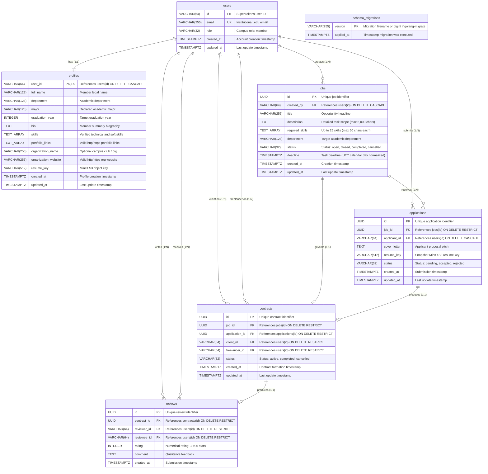
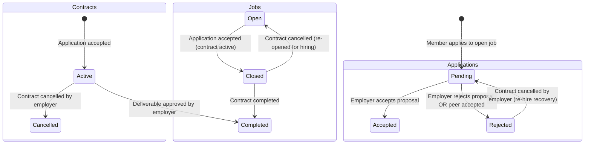

# Database Schema, Relational Constraints, & ERD - Lynk

> **Authoritative Database Specification**  
> **Database Engine:** PostgreSQL 16 Alpine (`lynk-postgres` on port `5432`)  
> **Databases:** `lynk_db` (application data) & `supertokens_db` (IAM data)  
> **Schema Migrations:** Raw SQL (`backend/migrations/000001` through `000011`)  
> **User Identity Type:** `VARCHAR(64)` (SuperTokens Core user identity format)

---

## 1. Entity-Relationship Diagram (ERD)

The Lynk relational model enforces data integrity, explicit foreign key constraints, and cascade/restrict rules across all seven domain tables.



---

## 2. Table-by-Table Schema Specification

### 2.1 `users`
Represents the authenticated identity synchronized from SuperTokens Core.
```sql
CREATE TABLE users (
    id VARCHAR(64) PRIMARY KEY,
    email VARCHAR(255) NOT NULL UNIQUE,
    role VARCHAR(32) NOT NULL DEFAULT 'member' CHECK (role IN ('member', 'admin')),
    created_at TIMESTAMPTZ NOT NULL DEFAULT NOW(),
    updated_at TIMESTAMPTZ NOT NULL DEFAULT NOW()
);
```

### 2.2 `profiles`
Unified campus profile capturing academic, professional, and organization context.
```sql
CREATE TABLE profiles (
    user_id VARCHAR(64) PRIMARY KEY REFERENCES users(id) ON DELETE CASCADE,
    full_name VARCHAR(128) NOT NULL DEFAULT '',
    department VARCHAR(128) NOT NULL DEFAULT '',
    major VARCHAR(128) NOT NULL DEFAULT '',
    graduation_year INTEGER CHECK (graduation_year >= 2020 AND graduation_year <= 2040),
    bio TEXT NOT NULL DEFAULT '',
    skills TEXT[] NOT NULL DEFAULT '{}',
    portfolio_links TEXT[] NOT NULL DEFAULT '{}',
    organization_name VARCHAR(255) NOT NULL DEFAULT '',
    organization_website VARCHAR(255) NOT NULL DEFAULT '',
    resume_key VARCHAR(512),
    created_at TIMESTAMPTZ NOT NULL DEFAULT NOW(),
    updated_at TIMESTAMPTZ NOT NULL DEFAULT NOW()
);
```

### 2.3 `jobs`
Campus opportunities and freelance gigs created by campus members.
```sql
CREATE TABLE jobs (
    id UUID PRIMARY KEY DEFAULT gen_random_uuid(),
    created_by VARCHAR(64) NOT NULL REFERENCES users(id) ON DELETE CASCADE,
    title VARCHAR(255) NOT NULL,
    description TEXT NOT NULL,
    required_skills TEXT[] NOT NULL DEFAULT '{}',
    department VARCHAR(128) NOT NULL DEFAULT '',
    status VARCHAR(32) NOT NULL DEFAULT 'open' CHECK (status IN ('open', 'closed', 'completed', 'cancelled')),
    deadline TIMESTAMPTZ,
    created_at TIMESTAMPTZ NOT NULL DEFAULT NOW(),
    updated_at TIMESTAMPTZ NOT NULL DEFAULT NOW()
);
```

### 2.4 `applications`
Member proposals submitted against open job postings.
```sql
CREATE TABLE applications (
    id UUID PRIMARY KEY DEFAULT gen_random_uuid(),
    job_id UUID NOT NULL REFERENCES jobs(id) ON DELETE RESTRICT,
    applicant_id VARCHAR(64) NOT NULL REFERENCES users(id) ON DELETE CASCADE,
    cover_letter TEXT NOT NULL,
    resume_key VARCHAR(512),
    status VARCHAR(32) NOT NULL DEFAULT 'pending' CHECK (status IN ('pending', 'accepted', 'rejected')),
    created_at TIMESTAMPTZ NOT NULL DEFAULT NOW(),
    updated_at TIMESTAMPTZ NOT NULL DEFAULT NOW(),
    CONSTRAINT uq_applications_job_applicant UNIQUE (job_id, applicant_id)
);
```

### 2.5 `contracts`
Direct deliverable agreements generated upon application acceptance.
```sql
CREATE TABLE contracts (
    id UUID PRIMARY KEY DEFAULT gen_random_uuid(),
    job_id UUID NOT NULL REFERENCES jobs(id) ON DELETE RESTRICT,
    application_id UUID NOT NULL REFERENCES applications(id) ON DELETE RESTRICT,
    client_id VARCHAR(64) NOT NULL REFERENCES users(id) ON DELETE RESTRICT,
    freelancer_id VARCHAR(64) NOT NULL REFERENCES users(id) ON DELETE RESTRICT,
    status VARCHAR(32) NOT NULL DEFAULT 'active' CHECK (status IN ('draft', 'active', 'completed', 'cancelled')),
    created_at TIMESTAMPTZ NOT NULL DEFAULT NOW(),
    updated_at TIMESTAMPTZ NOT NULL DEFAULT NOW(),
    CONSTRAINT uq_contracts_application UNIQUE (application_id)
);
```

### 2.6 `reviews`
Peer evaluation and 1-5 star ratings submitted upon contract completion.
```sql
CREATE TABLE reviews (
    id UUID PRIMARY KEY DEFAULT gen_random_uuid(),
    contract_id UUID NOT NULL REFERENCES contracts(id) ON DELETE RESTRICT,
    reviewer_id VARCHAR(64) NOT NULL REFERENCES users(id) ON DELETE RESTRICT,
    reviewee_id VARCHAR(64) NOT NULL REFERENCES users(id) ON DELETE RESTRICT,
    rating INTEGER NOT NULL CHECK (rating >= 1 AND rating <= 5),
    comment TEXT NOT NULL DEFAULT '',
    created_at TIMESTAMPTZ NOT NULL DEFAULT NOW(),
    CONSTRAINT uq_reviews_contract_reviewer UNIQUE (contract_id, reviewer_id)
);
```

---

## 3. Foreign Key Deletion Discipline

The database enforces a strict separation between cascading identities and protected transaction records:

| Relationship | Parent Table | Child Table | Foreign Key Column | Deletion Rule | Rationale |
| :--- | :--- | :--- | :--- | :--- | :--- |
| **Profile Ownership** | `users` | `profiles` | `user_id` | `ON DELETE CASCADE` | Profile is private metadata tied 1:1 to user account. |
| **Job Authoring** | `users` | `jobs` | `created_by` | `ON DELETE CASCADE` | Member deletions remove uncommitted postings. |
| **Application Submissions** | `users` | `applications` | `applicant_id` | `ON DELETE CASCADE` | Deleting a user withdraws pending proposals. |
| **Application Job Parent** | `jobs` | `applications` | `job_id` | `ON DELETE RESTRICT` | **F-08 Security Fix:** Prevents accidental deletion of job postings that have active proposals. |
| **Contract Client** | `users` | `contracts` | `client_id` | `ON DELETE RESTRICT` | Legal and deliverable audit logs cannot be orphaned. |
| **Contract Freelancer** | `users` | `contracts` | `freelancer_id` | `ON DELETE RESTRICT` | Deliverable obligations cannot be erased. |
| **Contract Parent Job** | `jobs` | `contracts` | `job_id` | `ON DELETE RESTRICT` | Jobs with contracts cannot be deleted. |
| **Contract Source App** | `applications` | `contracts` | `application_id` | `ON DELETE RESTRICT` | Applications with signed contracts cannot be deleted. |
| **Review Contract** | `contracts` | `reviews` | `contract_id` | `ON DELETE RESTRICT` | Completed transaction reviews are immutable. |

---

## 4. Index Catalog & Performance Invariants

B-tree and GiST indexes ensure queries execute within sub-millisecond latencies under concurrent load:

```sql
-- Foreign Key B-Tree Indexes (F-07: Prevents sequential table scans during joins and cascades)
CREATE INDEX idx_contracts_job_id ON contracts(job_id);
CREATE INDEX idx_contracts_application_id ON contracts(application_id);
CREATE INDEX idx_reviews_reviewer_id ON reviews(reviewer_id);
CREATE INDEX idx_reviews_reviewee_id ON reviews(reviewee_id);
CREATE INDEX idx_applications_applicant_id ON applications(applicant_id);

-- Marketplace Query Optimization Indexes
CREATE INDEX idx_jobs_status ON jobs(status);
CREATE INDEX idx_jobs_created_by ON jobs(created_by);
CREATE INDEX idx_jobs_department ON jobs(department);
CREATE INDEX idx_jobs_created_at_desc ON jobs(created_at DESC);

-- Compound Uniqueness Indexes
CREATE UNIQUE INDEX uq_applications_job_applicant ON applications(job_id, applicant_id);
CREATE UNIQUE INDEX uq_contracts_application ON contracts(application_id);
CREATE UNIQUE INDEX uq_reviews_contract_reviewer ON reviews(contract_id, reviewer_id);

-- Full-Text & Trigram Search (Migration 000006)
CREATE EXTENSION IF NOT EXISTS pg_trgm;
CREATE INDEX idx_jobs_title_trgm ON jobs USING gin (title gin_trgm_ops);
CREATE INDEX idx_jobs_description_trgm ON jobs USING gin (description gin_trgm_ops);
```

---

## 5. Contract & Application State Machine Transitions



### 5.1 Lock Ordering Discipline (F-01)
To eliminate cyclic deadlocks between concurrent application acceptance (`AcceptApplicationTx`) and contract cancellation (`UpdateContractStatus`), the backend enforces a global row lock acquisition order:
```text
Lock Order:  jobs  -->  applications  -->  contracts
```
1. `SELECT * FROM jobs WHERE id = $1 FOR UPDATE`
2. `SELECT * FROM applications WHERE id = $1 FOR UPDATE`
3. `UPDATE contracts SET status = $1 WHERE id = $2`

### 5.2 Application Re-Hire Restoration (F-03)
When an employer cancels an active contract:
- The contract transitions to `cancelled`.
- The parent job transitions from `closed` back to `open`.
- The accepted application transitions to `rejected`.
- All peer applications that were automatically rejected during acceptance are restored back to `pending`, allowing the employer to immediately hire an alternative candidate without re-creating the job posting.

---

## 6. Raw SQL Migration Registry (000001-000011)

| Migration File | Purpose & Changes | Breaking? | Reversible? | Notes |
| :--- | :--- | :--- | :--- | :--- |
| `000001_init_schema` | Creates baseline tables (`users`, `students`, `employers`, `jobs`, `applications`, `contracts`, `reviews`). | No | Yes | Initial MVP schema using UUIDs. |
| `000002_campus_member_unification` | Unifies `students` and `employers` into a single `profiles` table. Consolidates member role. | Yes | Yes | Drops role silos. Consolidates foreign keys. |
| `000003_supertokens_identity` | Alters `users.id` and all referencing foreign keys from `UUID` to `VARCHAR(64)` for SuperTokens compatibility. | Yes | Yes | Down migration converts back using `id::uuid`. |
| `000004_performance_and_contract_fixes` | Adds contract check constraints and marketplace performance indexes. | No | Yes | Non-destructive index additions. |
| `000005_cancel_rehire_contract_application` | Adds state machine support for contract cancellation and re-hire restoration. | No | Yes | Updates status check constraints. |
| `000006_search_trigram` | Enables `pg_trgm` extension and adds GIN trigram indexes on `jobs.title` and `jobs.description`. | No | Yes | Accelerates fuzzy title/keyword search. |
| `000007_contract_status_default_active` | Sets default status of new contracts to `active`. | No | Yes | Fixes contract creation default. |
| `000008_drop_redundant_indexes` | Removes duplicate redundant B-tree indexes that overlapped with compound unique constraints. | No | Yes | Reduces write amplification on inserts. |
| `000009_foreign_key_indexes_and_restrict` | Adds unconditional foreign key indexes on `contracts` and `reviews`. Sets `applications.job_id` to `ON DELETE RESTRICT`. | No | Yes | Eliminates sequential table scans and protects application audit logs. |
| `000010_seed_test_campus_members` | Seeds initial campus member test accounts and unified profiles in `lynk_db` and synchronizes credentials and roles to `supertokens_db` via `dblink`. | No | Yes | Provisions poster, applicant, and unverified test accounts for local development and CI testing. |
| `000011_remove_monetary_fields` | Drops monetary columns: `budget` and `pay_type` from `jobs`, and `agreed_budget` from `contracts`. | Yes | Yes | Fully decouples platform from monetary handling into pure campus discovery and deliverable collaboration. |
