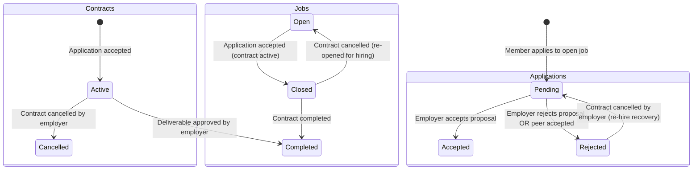

# Database Schema, Relational Constraints, & ERD - Lynk

> **Authoritative Database Specification**  
> **Database Engine:** PostgreSQL 16 Alpine (`lynk-postgres` on port `5432`)  
> **Databases:** `lynk_db` (application data) & `supertokens_db` (IAM data)  
> **Schema Migrations:** Raw SQL (`backend/migrations/000001` through `000012`)  
> **User Identity Type:** `VARCHAR(64)` (SuperTokens Core user identity format)

---

## 1. Entity-Relationship Diagram (ERD)

### 1.1 Core Marketplace Relational Model

The Lynk relational model enforces data integrity, explicit foreign key constraints, and cascade/restrict rules across all seven core domain tables.

```mermaid
erDiagram
    users ||--|| profiles : "has (1:1)"
    users ||--o{ jobs : "creates (1:N)"
    users ||--o{ applications : "submits (1:N)"
    users ||--o{ contracts : "client on (1:N)"
    users ||--o{ contracts : "freelancer on (1:N)"
    users ||--o{ reviews : "writes (1:N)"
    users ||--o{ reviews : "receives (1:N)"

    jobs ||--o{ applications : "receives (1:N)"
    jobs ||--o| contracts : "governs (1:1)"
    applications ||--o| contracts : "produces (1:1)"
    contracts ||--o| reviews : "produces (1:1)"

    users {
        VARCHAR(64) id PK "SuperTokens user ID"
        VARCHAR(255) email UK "Institutional .edu email"
        VARCHAR(32) role "Campus role: member"
        TIMESTAMPTZ created_at "Account creation timestamp"
        TIMESTAMPTZ updated_at "Last update timestamp"
    }

    profiles {
        VARCHAR(64) user_id PK, FK "References users(id) ON DELETE CASCADE"
        VARCHAR(128) full_name "Member legal name"
        VARCHAR(128) department "Academic department"
        VARCHAR(128) major "Declared academic major"
        INTEGER graduation_year "Target graduation year"
        TEXT bio "Member summary biography"
        TEXT_ARRAY skills "Verified technical and soft skills"
        TEXT_ARRAY portfolio_links "Valid http/https portfolio links"
        VARCHAR(255) organization_name "Optional campus club / org"
        VARCHAR(255) organization_website "Valid http/https org website"
        VARCHAR(512) resume_key "MinIO S3 object key"
        TIMESTAMPTZ created_at "Profile creation timestamp"
        TIMESTAMPTZ updated_at "Last update timestamp"
    }

    jobs {
        UUID id PK "Unique job identifier"
        VARCHAR(64) created_by FK "References users(id) ON DELETE CASCADE"
        VARCHAR(255) title "Opportunity headline"
        TEXT description "Detailed task scope (max 5,000 chars)"
        TEXT_ARRAY required_skills "Up to 25 skills (max 50 chars each)"
        VARCHAR(128) department "Target academic department"
        VARCHAR(32) status "Status: open, closed, completed, cancelled"
        TIMESTAMPTZ deadline "Task deadline (UTC calendar day normalized)"
        TIMESTAMPTZ created_at "Creation timestamp"
        TIMESTAMPTZ updated_at "Last update timestamp"
    }

    applications {
        UUID id PK "Unique application identifier"
        UUID job_id FK "References jobs(id) ON DELETE RESTRICT"
        VARCHAR(64) applicant_id FK "References users(id) ON DELETE CASCADE"
        TEXT cover_letter "Applicant proposal pitch"
        VARCHAR(512) resume_key "Snapshot MinIO S3 resume key"
        VARCHAR(32) status "Status: pending, accepted, rejected"
        TIMESTAMPTZ created_at "Submission timestamp"
        TIMESTAMPTZ updated_at "Last update timestamp"
    }

    contracts {
        UUID id PK "Unique contract identifier"
        UUID job_id FK "References jobs(id) ON DELETE RESTRICT"
        UUID application_id FK "References applications(id) ON DELETE RESTRICT"
        VARCHAR(64) client_id FK "References users(id) ON DELETE RESTRICT"
        VARCHAR(64) freelancer_id FK "References users(id) ON DELETE RESTRICT"
        VARCHAR(32) status "Status: active, completed, cancelled"
        TIMESTAMPTZ created_at "Contract formation timestamp"
        TIMESTAMPTZ updated_at "Last update timestamp"
    }

    reviews {
        UUID id PK "Unique review identifier"
        UUID contract_id FK "References contracts(id) ON DELETE RESTRICT"
        VARCHAR(64) reviewer_id FK "References users(id) ON DELETE RESTRICT"
        VARCHAR(64) reviewee_id FK "References users(id) ON DELETE RESTRICT"
        INTEGER rating "Numerical rating: 1 to 5 stars"
        TEXT comment "Qualitative feedback"
        TIMESTAMPTZ created_at "Submission timestamp"
    }

    schema_migrations {
        VARCHAR(255) version PK "Migration filename or bigint if golang-migrate"
        TIMESTAMPTZ applied_at "Timestamp migration was executed"
    }
```



### 1.2 First-Class AI Subsystem Model (Migration 000012)

Migration `000012_ai_subsystem_init.up.sql` establishes 12 dedicated relational tables and the `vector(384)` pgvector embedding type supporting skill taxonomy, semantic vector search, advisory ranking, asynchronous background processing, and run telemetry:

```mermaid
erDiagram
    skills ||--o{ skills : "parent of (1:N)"
    skills ||--o{ skill_aliases : "aliases (1:N)"
    users ||--o{ profile_skills : "possesses (1:N)"
    skills ||--o{ profile_skills : "categorized by (1:N)"
    jobs ||--o{ job_skills : "requires (1:N)"
    skills ||--o{ job_skills : "categorized by (1:N)"
    users ||--o{ ai_recommendations : "receives (1:N)"
    applications ||--o| application_ai_scores : "scored by (1:1)"
    jobs ||--o{ application_ai_scores : "context for (1:N)"
    users ||--o{ review_insights : "summarizes (1:N)"
    skills ||--o{ skill_demand_snapshots : "tracks (1:N)"

    skills {
        UUID id PK "Unique skill identifier"
        VARCHAR(100) canonical_name UK "Standardized skill title"
        TEXT description "Detailed skill description"
        VARCHAR(50) category "Domain category"
        UUID parent_skill_id FK "Hierarchy link ON DELETE SET NULL"
        TIMESTAMPTZ created_at "Creation timestamp"
        TIMESTAMPTZ updated_at "Update timestamp"
    }

    skill_aliases {
        UUID id PK "Unique alias identifier"
        UUID skill_id FK "References skills(id) ON DELETE CASCADE"
        VARCHAR(100) alias UK "Alternative phrasing or synonym"
        VARCHAR(50) source "Origin: manual, taxonomy, extracted"
        FLOAT confidence "Confidence score [0.0, 1.0]"
        TIMESTAMPTZ created_at "Creation timestamp"
    }

    profile_skills {
        VARCHAR(64) user_id PK, FK "References users(id) ON DELETE CASCADE"
        UUID skill_id PK, FK "References skills(id) ON DELETE CASCADE"
        FLOAT confidence "Skill confidence [0.0, 1.0]"
        VARCHAR(50) source "Origin: user, ai_resume_parser"
        BOOLEAN verified "Verification status"
        TIMESTAMPTZ created_at "Creation timestamp"
        TIMESTAMPTZ updated_at "Update timestamp"
    }

    job_skills {
        UUID job_id PK, FK "References jobs(id) ON DELETE CASCADE"
        UUID skill_id PK, FK "References skills(id) ON DELETE CASCADE"
        VARCHAR(20) importance "Importance: required, preferred"
        BOOLEAN required "Strict requirement flag"
        FLOAT confidence "Confidence score [0.0, 1.0]"
        TIMESTAMPTZ created_at "Creation timestamp"
        TIMESTAMPTZ updated_at "Update timestamp"
    }

    ai_embeddings {
        UUID id PK "Unique vector identifier"
        VARCHAR(50) entity_type "Entity: job, profile, skill"
        VARCHAR(64) entity_id "Target identifier"
        VARCHAR(50) embedding_type "Type: semantic, title, full_text"
        VARCHAR(100) model_name "Model: all-MiniLM-L6-v2"
        VARCHAR(50) model_version "Model version tag: 2.0"
        VARCHAR(64) content_hash "SHA-256 idempotency hash"
        VECTOR(384) embedding "Dense 384-dim vector with HNSW index"
        TIMESTAMPTZ created_at "Creation timestamp"
        TIMESTAMPTZ updated_at "Update timestamp"
    }

    ai_runs {
        UUID id PK "Audit log identifier"
        VARCHAR(50) feature "Feature: search, ranking, moderation, draft"
        VARCHAR(50) entity_type "Entity: job, application, profile"
        VARCHAR(64) entity_id "Entity identifier"
        VARCHAR(100) model_name "Underlying model name"
        VARCHAR(50) model_version "Model version identifier"
        VARCHAR(50) prompt_version "Prompt template version"
        VARCHAR(50) pipeline_version "Execution pipeline version"
        VARCHAR(64) input_hash "SHA-256 hash of inputs"
        JSONB output_json "Structured output payload"
        FLOAT confidence "Telemetry confidence score"
        INTEGER latency_ms "Execution duration in milliseconds"
        VARCHAR(20) status "Status: success, error, fallback"
        TEXT error "Error message if failed"
        TIMESTAMPTZ created_at "Execution timestamp"
    }

    ai_recommendations {
        UUID id PK "Recommendation identifier"
        VARCHAR(64) user_id FK "References users(id) ON DELETE CASCADE"
        VARCHAR(50) type "Type: skill, profile, opportunity"
        VARCHAR(255) title "Recommendation headline"
        TEXT reason "Transparent non-empty explanation"
        FLOAT confidence "Confidence score [0.0, 1.0]"
        JSONB metadata "Contextual payload"
        VARCHAR(20) status "Status: active, dismissed, applied"
        TIMESTAMPTZ created_at "Creation timestamp"
        TIMESTAMPTZ updated_at "Update timestamp"
    }

    application_ai_scores {
        UUID id PK "Score identifier"
        UUID application_id UK, FK "References applications(id) ON DELETE CASCADE"
        UUID job_id FK "References jobs(id) ON DELETE CASCADE"
        FLOAT score "Advisory composite score (0-100)"
        TEXT_ARRAY matched_skills "Observable matching skills"
        TEXT_ARRAY missing_skills "Observable missing requirements"
        TEXT reason "Structured advisory reasoning"
        FLOAT confidence "Scoring confidence [0.0, 1.0]"
        INTEGER job_version "Job revision version"
        INTEGER profile_version "Profile revision version"
        VARCHAR(50) model_version "Model version identifier"
        VARCHAR(50) pipeline_version "Pipeline version identifier"
        BOOLEAN is_stale "Cache invalidation flag"
        TIMESTAMPTZ created_at "Scoring timestamp"
        TIMESTAMPTZ updated_at "Update timestamp"
    }

    moderation_events {
        UUID id PK "Event identifier"
        VARCHAR(50) entity_type "Entity: job, application, review"
        VARCHAR(64) entity_id "Entity identifier"
        FLOAT risk_score "Computed risk score [0.0, 1.0]"
        VARCHAR(20) decision "Decision: allow, flag, block"
        TEXT_ARRAY signals "Triggered heuristic and semantic signals"
        FLOAT confidence "Moderation confidence [0.0, 1.0]"
        VARCHAR(50) pipeline_version "Pipeline version identifier"
        TIMESTAMPTZ created_at "Evaluation timestamp"
    }

    review_insights {
        UUID id PK "Insight identifier"
        VARCHAR(64) user_id FK "References users(id) ON DELETE CASCADE"
        VARCHAR(50) aspect "Aspect: timeliness, communication, technical"
        FLOAT score "Aggregated aspect score (1-5)"
        FLOAT confidence "Aggregated confidence [0.0, 1.0]"
        INTEGER sample_count "Analyzed review count"
        BOOLEAN is_recurring "Recurring pattern flag (>= 3 samples)"
        TEXT_ARRAY strengths "Synthesized positive traits"
        TEXT_ARRAY improvements "Synthesized constructive traits"
        TIMESTAMPTZ created_at "Creation timestamp"
        TIMESTAMPTZ updated_at "Update timestamp"
    }

    skill_demand_snapshots {
        UUID id PK "Snapshot identifier"
        UUID skill_id FK "References skills(id) ON DELETE CASCADE"
        VARCHAR(20) period "Period identifier: 2026-W37, 2026-09"
        INTEGER job_count "Total job postings requiring skill"
        INTEGER application_count "Total applications citing skill"
        INTEGER unique_posters "Distinct employers seeking skill"
        FLOAT demand_score "Normalized demand intensity [0.0, 1.0]"
        FLOAT growth_rate "Period-over-period growth rate"
        TIMESTAMPTZ created_at "Snapshot timestamp"
    }

    ai_jobs {
        UUID id PK "Background task identifier"
        VARCHAR(50) job_type "Task type: generate_embedding, parse_resume"
        VARCHAR(50) entity_type "Target entity type"
        VARCHAR(64) entity_id "Target entity identifier"
        JSONB payload "Task execution parameters"
        VARCHAR(20) status "Status: pending, processing, completed, failed, dead_letter"
        INTEGER attempts "Current execution attempts"
        INTEGER max_attempts "Maximum retry threshold"
        TEXT error "Failure traceback details"
        VARCHAR(64) content_hash "Idempotency input hash"
        TIMESTAMPTZ created_at "Queue enqueue timestamp"
        TIMESTAMPTZ started_at "Worker lock timestamp"
        TIMESTAMPTZ completed_at "Worker termination timestamp"
    }
```



---

## 2. Table-by-Table Schema Specification

### 2.1 `users`
Represents the authenticated identity synchronized from SuperTokens Core.
```sql
CREATE TABLE users (
    id VARCHAR(64) PRIMARY KEY,
    email VARCHAR(255) NOT NULL UNIQUE,
    role VARCHAR(32) NOT NULL DEFAULT 'member' CHECK (role IN ('member', 'admin')),
    created_at TIMESTAMPTZ NOT NULL DEFAULT NOW(),
    updated_at TIMESTAMPTZ NOT NULL DEFAULT NOW()
);
```

### 2.2 `profiles`
Unified campus profile capturing academic, professional, and organization context.
```sql
CREATE TABLE profiles (
    user_id VARCHAR(64) PRIMARY KEY REFERENCES users(id) ON DELETE CASCADE,
    full_name VARCHAR(128) NOT NULL DEFAULT '',
    department VARCHAR(128) NOT NULL DEFAULT '',
    major VARCHAR(128) NOT NULL DEFAULT '',
    graduation_year INTEGER CHECK (graduation_year >= 2020 AND graduation_year <= 2040),
    bio TEXT NOT NULL DEFAULT '',
    skills TEXT[] NOT NULL DEFAULT '{}',
    portfolio_links TEXT[] NOT NULL DEFAULT '{}',
    organization_name VARCHAR(255) NOT NULL DEFAULT '',
    organization_website VARCHAR(255) NOT NULL DEFAULT '',
    resume_key VARCHAR(512),
    created_at TIMESTAMPTZ NOT NULL DEFAULT NOW(),
    updated_at TIMESTAMPTZ NOT NULL DEFAULT NOW()
);
```

### 2.3 `jobs`
Campus opportunities and freelance gigs created by campus members.
```sql
CREATE TABLE jobs (
    id UUID PRIMARY KEY DEFAULT gen_random_uuid(),
    created_by VARCHAR(64) NOT NULL REFERENCES users(id) ON DELETE CASCADE,
    title VARCHAR(255) NOT NULL,
    description TEXT NOT NULL,
    required_skills TEXT[] NOT NULL DEFAULT '{}',
    department VARCHAR(128) NOT NULL DEFAULT '',
    status VARCHAR(32) NOT NULL DEFAULT 'open' CHECK (status IN ('open', 'closed', 'completed', 'cancelled')),
    deadline TIMESTAMPTZ,
    created_at TIMESTAMPTZ NOT NULL DEFAULT NOW(),
    updated_at TIMESTAMPTZ NOT NULL DEFAULT NOW()
);
```

### 2.4 `applications`
Member proposals submitted against open job postings.
```sql
CREATE TABLE applications (
    id UUID PRIMARY KEY DEFAULT gen_random_uuid(),
    job_id UUID NOT NULL REFERENCES jobs(id) ON DELETE RESTRICT,
    applicant_id VARCHAR(64) NOT NULL REFERENCES users(id) ON DELETE CASCADE,
    cover_letter TEXT NOT NULL,
    resume_key VARCHAR(512),
    status VARCHAR(32) NOT NULL DEFAULT 'pending' CHECK (status IN ('pending', 'accepted', 'rejected')),
    created_at TIMESTAMPTZ NOT NULL DEFAULT NOW(),
    updated_at TIMESTAMPTZ NOT NULL DEFAULT NOW(),
    CONSTRAINT uq_applications_job_applicant UNIQUE (job_id, applicant_id)
);
```

### 2.5 `contracts`
Direct deliverable agreements generated upon application acceptance.
```sql
CREATE TABLE contracts (
    id UUID PRIMARY KEY DEFAULT gen_random_uuid(),
    job_id UUID NOT NULL REFERENCES jobs(id) ON DELETE RESTRICT,
    application_id UUID NOT NULL REFERENCES applications(id) ON DELETE RESTRICT,
    client_id VARCHAR(64) NOT NULL REFERENCES users(id) ON DELETE RESTRICT,
    freelancer_id VARCHAR(64) NOT NULL REFERENCES users(id) ON DELETE RESTRICT,
    status VARCHAR(32) NOT NULL DEFAULT 'active' CHECK (status IN ('draft', 'active', 'completed', 'cancelled')),
    created_at TIMESTAMPTZ NOT NULL DEFAULT NOW(),
    updated_at TIMESTAMPTZ NOT NULL DEFAULT NOW(),
    CONSTRAINT uq_contracts_application UNIQUE (application_id)
);
```

### 2.6 `reviews`
Peer evaluation and 1-5 star ratings submitted upon contract completion.
```sql
CREATE TABLE reviews (
    id UUID PRIMARY KEY DEFAULT gen_random_uuid(),
    contract_id UUID NOT NULL REFERENCES contracts(id) ON DELETE RESTRICT,
    reviewer_id VARCHAR(64) NOT NULL REFERENCES users(id) ON DELETE RESTRICT,
    reviewee_id VARCHAR(64) NOT NULL REFERENCES users(id) ON DELETE RESTRICT,
    rating INTEGER NOT NULL CHECK (rating >= 1 AND rating <= 5),
    comment TEXT NOT NULL DEFAULT '',
    created_at TIMESTAMPTZ NOT NULL DEFAULT NOW(),
    CONSTRAINT uq_reviews_contract_reviewer UNIQUE (contract_id, reviewer_id)
);
```

### 2.7 `skills`
Canonical taxonomy of standardized campus skills supporting hierarchical taxonomy trees.
```sql
CREATE TABLE skills (
    id UUID PRIMARY KEY DEFAULT gen_random_uuid(),
    canonical_name VARCHAR(100) NOT NULL UNIQUE,
    description TEXT,
    category VARCHAR(50),
    parent_skill_id UUID REFERENCES skills(id) ON DELETE SET NULL,
    created_at TIMESTAMPTZ NOT NULL DEFAULT NOW(),
    updated_at TIMESTAMPTZ NOT NULL DEFAULT NOW()
);
```

### 2.8 `skill_aliases`
Synonym and typo lookup table mapping informal or variant skill strings to canonical skills.
```sql
CREATE TABLE skill_aliases (
    id UUID PRIMARY KEY DEFAULT gen_random_uuid(),
    skill_id UUID NOT NULL REFERENCES skills(id) ON DELETE CASCADE,
    alias VARCHAR(100) NOT NULL UNIQUE,
    source VARCHAR(50) NOT NULL DEFAULT 'manual',
    confidence DOUBLE PRECISION NOT NULL DEFAULT 1.0,
    created_at TIMESTAMPTZ NOT NULL DEFAULT NOW()
);
```

### 2.9 `profile_skills`
Attribution table mapping verified or user-declared skills to campus member profiles.
```sql
CREATE TABLE profile_skills (
    user_id VARCHAR(64) NOT NULL REFERENCES users(id) ON DELETE CASCADE,
    skill_id UUID NOT NULL REFERENCES skills(id) ON DELETE CASCADE,
    confidence DOUBLE PRECISION NOT NULL DEFAULT 1.0,
    source VARCHAR(50) NOT NULL DEFAULT 'user',
    verified BOOLEAN NOT NULL DEFAULT false,
    created_at TIMESTAMPTZ NOT NULL DEFAULT NOW(),
    updated_at TIMESTAMPTZ NOT NULL DEFAULT NOW(),
    PRIMARY KEY (user_id, skill_id)
);
```

### 2.10 `job_skills`
Explicit and AI-extracted required or preferred skills tied to job postings.
```sql
CREATE TABLE job_skills (
    job_id UUID NOT NULL REFERENCES jobs(id) ON DELETE CASCADE,
    skill_id UUID NOT NULL REFERENCES skills(id) ON DELETE CASCADE,
    importance VARCHAR(20) NOT NULL DEFAULT 'required',
    required BOOLEAN NOT NULL DEFAULT true,
    confidence DOUBLE PRECISION NOT NULL DEFAULT 1.0,
    created_at TIMESTAMPTZ NOT NULL DEFAULT NOW(),
    updated_at TIMESTAMPTZ NOT NULL DEFAULT NOW(),
    PRIMARY KEY (job_id, skill_id)
);
```

### 2.11 `ai_embeddings`
Dense 384-dimension vector embeddings indexed using HNSW vector distance operators.
```sql
CREATE TABLE ai_embeddings (
    id UUID PRIMARY KEY DEFAULT gen_random_uuid(),
    entity_type VARCHAR(50) NOT NULL,
    entity_id VARCHAR(64) NOT NULL,
    embedding_type VARCHAR(50) NOT NULL DEFAULT 'semantic',
    model_name VARCHAR(100) NOT NULL,
    model_version VARCHAR(50) NOT NULL,
    content_hash VARCHAR(64) NOT NULL,
    embedding vector(384) NOT NULL,
    created_at TIMESTAMPTZ NOT NULL DEFAULT NOW(),
    updated_at TIMESTAMPTZ NOT NULL DEFAULT NOW(),
    UNIQUE(entity_type, entity_id, embedding_type, model_name, model_version)
);
```

### 2.12 `ai_runs`
Complete execution telemetry, input hashing, and performance auditing for all AI pipelines.
```sql
CREATE TABLE ai_runs (
    id UUID PRIMARY KEY DEFAULT gen_random_uuid(),
    feature VARCHAR(50) NOT NULL,
    entity_type VARCHAR(50) NOT NULL,
    entity_id VARCHAR(64) NOT NULL,
    model_name VARCHAR(100) NOT NULL,
    model_version VARCHAR(50) NOT NULL,
    prompt_version VARCHAR(50),
    pipeline_version VARCHAR(50) NOT NULL,
    input_hash VARCHAR(64) NOT NULL,
    output_json JSONB NOT NULL DEFAULT '{}',
    confidence DOUBLE PRECISION,
    latency_ms INTEGER NOT NULL DEFAULT 0,
    status VARCHAR(20) NOT NULL DEFAULT 'success',
    error TEXT,
    created_at TIMESTAMPTZ NOT NULL DEFAULT NOW()
);
```

### 2.13 `ai_recommendations`
Personalized member suggestions for skill acquisition and profile completion.
```sql
CREATE TABLE ai_recommendations (
    id UUID PRIMARY KEY DEFAULT gen_random_uuid(),
    user_id VARCHAR(64) NOT NULL REFERENCES users(id) ON DELETE CASCADE,
    type VARCHAR(50) NOT NULL,
    title VARCHAR(255) NOT NULL,
    reason TEXT NOT NULL,
    confidence DOUBLE PRECISION NOT NULL DEFAULT 0.0,
    metadata JSONB NOT NULL DEFAULT '{}',
    status VARCHAR(20) NOT NULL DEFAULT 'active',
    created_at TIMESTAMPTZ NOT NULL DEFAULT NOW(),
    updated_at TIMESTAMPTZ NOT NULL DEFAULT NOW()
);
```

### 2.14 `application_ai_scores`
Advisory scoring table caching candidate rank scores and explainable rationale.
```sql
CREATE TABLE application_ai_scores (
    id UUID PRIMARY KEY DEFAULT gen_random_uuid(),
    application_id UUID NOT NULL REFERENCES applications(id) ON DELETE CASCADE,
    job_id UUID NOT NULL REFERENCES jobs(id) ON DELETE CASCADE,
    score DOUBLE PRECISION NOT NULL,
    matched_skills TEXT[] NOT NULL DEFAULT '{}',
    missing_skills TEXT[] NOT NULL DEFAULT '{}',
    reason TEXT NOT NULL,
    confidence DOUBLE PRECISION NOT NULL,
    job_version INTEGER NOT NULL DEFAULT 1,
    profile_version INTEGER NOT NULL DEFAULT 1,
    model_version VARCHAR(50) NOT NULL,
    pipeline_version VARCHAR(50) NOT NULL,
    is_stale BOOLEAN NOT NULL DEFAULT false,
    created_at TIMESTAMPTZ NOT NULL DEFAULT NOW(),
    updated_at TIMESTAMPTZ NOT NULL DEFAULT NOW(),
    UNIQUE(application_id)
);
```

### 2.15 `moderation_events`
Content safety evaluation logs tracking computed risk scores and rule-based heuristic signals.
```sql
CREATE TABLE moderation_events (
    id UUID PRIMARY KEY DEFAULT gen_random_uuid(),
    entity_type VARCHAR(50) NOT NULL,
    entity_id VARCHAR(64) NOT NULL,
    risk_score DOUBLE PRECISION NOT NULL,
    decision VARCHAR(20) NOT NULL DEFAULT 'allow',
    signals TEXT[] NOT NULL DEFAULT '{}',
    confidence DOUBLE PRECISION NOT NULL,
    pipeline_version VARCHAR(50) NOT NULL,
    created_at TIMESTAMPTZ NOT NULL DEFAULT NOW()
);
```

### 2.16 `review_insights`
Aggregated peer review aspect scores and recurring behavioral patterns.
```sql
CREATE TABLE review_insights (
    id UUID PRIMARY KEY DEFAULT gen_random_uuid(),
    user_id VARCHAR(64) NOT NULL REFERENCES users(id) ON DELETE CASCADE,
    aspect VARCHAR(50) NOT NULL,
    score DOUBLE PRECISION NOT NULL,
    confidence DOUBLE PRECISION NOT NULL,
    sample_count INTEGER NOT NULL DEFAULT 1,
    is_recurring BOOLEAN NOT NULL DEFAULT false,
    strengths TEXT[] NOT NULL DEFAULT '{}',
    improvements TEXT[] NOT NULL DEFAULT '{}',
    created_at TIMESTAMPTZ NOT NULL DEFAULT NOW(),
    updated_at TIMESTAMPTZ NOT NULL DEFAULT NOW(),
    UNIQUE(user_id, aspect)
);
```

### 2.17 `skill_demand_snapshots`
Time-bucketed analytics tracking marketplace demand velocity and growth trajectories.
```sql
CREATE TABLE skill_demand_snapshots (
    id UUID PRIMARY KEY DEFAULT gen_random_uuid(),
    skill_id UUID NOT NULL REFERENCES skills(id) ON DELETE CASCADE,
    period VARCHAR(20) NOT NULL,
    job_count INTEGER NOT NULL DEFAULT 0,
    application_count INTEGER NOT NULL DEFAULT 0,
    unique_posters INTEGER NOT NULL DEFAULT 0,
    demand_score DOUBLE PRECISION NOT NULL DEFAULT 0.0,
    growth_rate DOUBLE PRECISION NOT NULL DEFAULT 0.0,
    created_at TIMESTAMPTZ NOT NULL DEFAULT NOW(),
    UNIQUE(skill_id, period)
);
```

### 2.18 `ai_jobs`
Durable background job queue processed by `ai-worker` using `FOR UPDATE SKIP LOCKED`.
```sql
CREATE TABLE ai_jobs (
    id UUID PRIMARY KEY DEFAULT gen_random_uuid(),
    job_type VARCHAR(50) NOT NULL,
    entity_type VARCHAR(50) NOT NULL,
    entity_id VARCHAR(64) NOT NULL,
    payload JSONB NOT NULL DEFAULT '{}',
    status VARCHAR(20) NOT NULL DEFAULT 'pending',
    attempts INTEGER NOT NULL DEFAULT 0,
    max_attempts INTEGER NOT NULL DEFAULT 3,
    error TEXT,
    content_hash VARCHAR(64),
    created_at TIMESTAMPTZ NOT NULL DEFAULT NOW(),
    started_at TIMESTAMPTZ,
    completed_at TIMESTAMPTZ
);
```

---

## 3. Foreign Key Deletion Discipline

The database enforces a strict separation between cascading identities and protected transaction records:

| Relationship | Parent Table | Child Table | Foreign Key Column | Deletion Rule | Rationale |
| :--- | :--- | :--- | :--- | :--- | :--- |
| **Profile Ownership** | `users` | `profiles` | `user_id` | `ON DELETE CASCADE` | Profile is private metadata tied 1:1 to user account. |
| **Job Authoring** | `users` | `jobs` | `created_by` | `ON DELETE CASCADE` | Member deletions remove uncommitted postings. |
| **Application Submissions** | `users` | `applications` | `applicant_id` | `ON DELETE CASCADE` | Deleting a user withdraws pending proposals. |
| **Application Job Parent** | `jobs` | `applications` | `job_id` | `ON DELETE RESTRICT` | **F-08 Security Fix:** Prevents accidental deletion of job postings that have active proposals. |
| **Contract Client** | `users` | `contracts` | `client_id` | `ON DELETE RESTRICT` | Legal and deliverable audit logs cannot be orphaned. |
| **Contract Freelancer** | `users` | `contracts` | `freelancer_id` | `ON DELETE RESTRICT` | Deliverable obligations cannot be erased. |
| **Contract Parent Job** | `jobs` | `contracts` | `job_id` | `ON DELETE RESTRICT` | Jobs with contracts cannot be deleted. |
| **Contract Source App** | `applications` | `contracts` | `application_id` | `ON DELETE RESTRICT` | Applications with signed contracts cannot be deleted. |
| **Review Contract** | `contracts` | `reviews` | `contract_id` | `ON DELETE RESTRICT` | Completed transaction reviews are immutable. |
| **Skill Hierarchy** | `skills` | `skills` | `parent_skill_id` | `ON DELETE SET NULL` | Parent skill removal preserves child skills as top-level nodes. |
| **Skill Aliases** | `skills` | `skill_aliases` | `skill_id` | `ON DELETE CASCADE` | Alias records belong strictly to parent canonical skill. |
| **Profile Skills User** | `users` | `profile_skills` | `user_id` | `ON DELETE CASCADE` | Deleting member removes skill attributions. |
| **Profile Skills Skill** | `skills` | `profile_skills` | `skill_id` | `ON DELETE CASCADE` | Removing skill from taxonomy prunes member attributions. |
| **Job Skills Job** | `jobs` | `job_skills` | `job_id` | `ON DELETE CASCADE` | Job deletion cascades to skill requirement links. |
| **Job Skills Skill** | `skills` | `job_skills` | `skill_id` | `ON DELETE CASCADE` | Removing skill from taxonomy prunes job requirement links. |
| **AI Recommendations** | `users` | `ai_recommendations` | `user_id` | `ON DELETE CASCADE` | Member removal clears personalized recommendation history. |
| **App AI Score App** | `applications` | `application_ai_scores` | `application_id` | `ON DELETE CASCADE` | Application deletion clears associated advisory rank scores. |
| **App AI Score Job** | `jobs` | `application_ai_scores` | `job_id` | `ON DELETE CASCADE` | Job deletion cascades to advisory rank scores. |
| **Review Insights** | `users` | `review_insights` | `user_id` | `ON DELETE CASCADE` | Member deletion removes aggregated aspect score summaries. |
| **Skill Demand Snap** | `skills` | `skill_demand_snapshots` | `skill_id` | `ON DELETE CASCADE` | Taxonomy pruning cascades to historical demand snapshots. |

---

## 4. Index Catalog & Performance Invariants

B-tree, GiST, GIN, and HNSW indexes ensure queries execute within sub-millisecond latencies under concurrent load:

```sql
-- Foreign Key B-Tree Indexes (F-07: Prevents sequential table scans during joins and cascades)
CREATE INDEX idx_contracts_job_id ON contracts(job_id);
CREATE INDEX idx_contracts_application_id ON contracts(application_id);
CREATE INDEX idx_reviews_reviewer_id ON reviews(reviewer_id);
CREATE INDEX idx_reviews_reviewee_id ON reviews(reviewee_id);
CREATE INDEX idx_applications_applicant_id ON applications(applicant_id);

-- Marketplace Query Optimization Indexes
CREATE INDEX idx_jobs_status ON jobs(status);
CREATE INDEX idx_jobs_created_by ON jobs(created_by);
CREATE INDEX idx_jobs_department ON jobs(department);
CREATE INDEX idx_jobs_created_at_desc ON jobs(created_at DESC);

-- Compound Uniqueness Indexes
CREATE UNIQUE INDEX uq_applications_job_applicant ON applications(job_id, applicant_id);
CREATE UNIQUE INDEX uq_contracts_application ON contracts(application_id);
CREATE UNIQUE INDEX uq_reviews_contract_reviewer ON reviews(contract_id, reviewer_id);

-- Full-Text & Trigram Search (Migration 000006)
CREATE EXTENSION IF NOT EXISTS pg_trgm;
CREATE INDEX idx_jobs_title_trgm ON jobs USING gin (title gin_trgm_ops);
CREATE INDEX idx_jobs_description_trgm ON jobs USING gin (description gin_trgm_ops);

-- AI Subsystem: pgvector HNSW Dense Cosine Similarity Index (Migration 000012)
CREATE EXTENSION IF NOT EXISTS vector;
CREATE INDEX idx_ai_embeddings_embedding ON ai_embeddings USING hnsw (embedding vector_cosine_ops);
CREATE INDEX idx_ai_embeddings_entity ON ai_embeddings(entity_type, entity_id);

-- AI Subsystem: Taxonomy & Mapping Indexes
CREATE INDEX idx_skills_parent_skill_id ON skills(parent_skill_id);
CREATE INDEX idx_skills_category ON skills(category);
CREATE INDEX idx_skill_aliases_skill_id ON skill_aliases(skill_id);
CREATE INDEX idx_profile_skills_skill_id ON profile_skills(skill_id);
CREATE INDEX idx_job_skills_skill_id ON job_skills(skill_id);

-- AI Subsystem: Telemetry, Recommendations, & Scoring Indexes
CREATE INDEX idx_ai_runs_entity ON ai_runs(entity_type, entity_id);
CREATE INDEX idx_ai_runs_feature ON ai_runs(feature);
CREATE INDEX idx_ai_runs_status ON ai_runs(status);
CREATE INDEX idx_ai_runs_created_at ON ai_runs(created_at DESC);
CREATE INDEX idx_ai_recommendations_user_id ON ai_recommendations(user_id);
CREATE INDEX idx_ai_recommendations_status ON ai_recommendations(status);
CREATE INDEX idx_ai_recommendations_type ON ai_recommendations(type);
CREATE INDEX idx_application_ai_scores_job_id ON application_ai_scores(job_id);
CREATE INDEX idx_application_ai_scores_is_stale ON application_ai_scores(is_stale);
CREATE INDEX idx_moderation_events_entity ON moderation_events(entity_type, entity_id);
CREATE INDEX idx_moderation_events_decision ON moderation_events(decision);
CREATE INDEX idx_moderation_events_created_at ON moderation_events(created_at DESC);
CREATE INDEX idx_review_insights_user_id ON review_insights(user_id);
CREATE INDEX idx_skill_demand_snapshots_skill_id ON skill_demand_snapshots(skill_id);
CREATE INDEX idx_skill_demand_snapshots_period ON skill_demand_snapshots(period);

-- AI Subsystem: Durable Background Queue (FOR UPDATE SKIP LOCKED Polling Optimization)
CREATE INDEX idx_ai_jobs_status_created_at ON ai_jobs(status, created_at);
CREATE INDEX idx_ai_jobs_entity ON ai_jobs(entity_type, entity_id);
CREATE INDEX idx_ai_jobs_job_type ON ai_jobs(job_type);
```

---

## 5. Contract & Application State Machine Transitions



### 5.1 Lock Ordering Discipline (F-01)
To eliminate cyclic deadlocks between concurrent application acceptance (`AcceptApplicationTx`) and contract cancellation (`UpdateContractStatus`), the backend enforces a global row lock acquisition order:
```text
Lock Order:  jobs  -->  applications  -->  contracts
```
1. `SELECT * FROM jobs WHERE id = $1 FOR UPDATE`
2. `SELECT * FROM applications WHERE id = $1 FOR UPDATE`
3. `UPDATE contracts SET status = $1 WHERE id = $2`

### 5.2 Application Re-Hire Restoration (F-03)
When an employer cancels an active contract:
- The contract transitions to `cancelled`.
- The parent job transitions from `closed` back to `open`.
- The accepted application transitions to `rejected`.
- All peer applications that were automatically rejected during acceptance are restored back to `pending`, allowing the employer to immediately hire an alternative candidate without re-creating the job posting.

---

## 6. Raw SQL Migration Registry (000001-000012)

| Migration File | Purpose & Changes | Breaking? | Reversible? | Notes |
| :--- | :--- | :--- | :--- | :--- |
| `000001_init_schema` | Creates baseline tables (`users`, `students`, `employers`, `jobs`, `applications`, `contracts`, `reviews`). | No | Yes | Initial MVP schema using UUIDs. |
| `000002_campus_member_unification` | Unifies `students` and `employers` into a single `profiles` table. Consolidates member role. | Yes | Yes | Drops role silos. Consolidates foreign keys. |
| `000003_supertokens_identity` | Alters `users.id` and all referencing foreign keys from `UUID` to `VARCHAR(64)` for SuperTokens compatibility. | Yes | Yes | Down migration converts back using `id::uuid`. |
| `000004_performance_and_contract_fixes` | Adds contract check constraints and marketplace performance indexes. | No | Yes | Non-destructive index additions. |
| `000005_cancel_rehire_contract_application` | Adds state machine support for contract cancellation and re-hire restoration. | No | Yes | Updates status check constraints. |
| `000006_search_trigram` | Enables `pg_trgm` extension and adds GIN trigram indexes on `jobs.title` and `jobs.description`. | No | Yes | Accelerates fuzzy title/keyword search. |
| `000007_contract_status_default_active` | Sets default status of new contracts to `active`. | No | Yes | Fixes contract creation default. |
| `000008_drop_redundant_indexes` | Removes duplicate redundant B-tree indexes that overlapped with compound unique constraints. | No | Yes | Reduces write amplification on inserts. |
| `000009_foreign_key_indexes_and_restrict` | Adds unconditional foreign key indexes on `contracts` and `reviews`. Sets `applications.job_id` to `ON DELETE RESTRICT`. | No | Yes | Eliminates sequential table scans and protects application audit logs. |
| `000010_seed_test_campus_members` | Seeds initial campus member test accounts and unified profiles in `lynk_db` and synchronizes credentials and roles to `supertokens_db` via `dblink`. | No | Yes | Provisions poster, applicant, and unverified test accounts for local development and CI testing. |
| `000011_remove_monetary_fields` | Drops monetary columns: `budget` and `pay_type` from `jobs`, and `agreed_budget` from `contracts`. | Yes | Yes | Fully decouples platform from monetary handling into pure campus discovery and deliverable collaboration. |
| `000012_ai_subsystem_init` | Installs `pgvector` extension and creates 12 tables (`skills`, `skill_aliases`, `profile_skills`, `job_skills`, `ai_embeddings`, `ai_runs`, `ai_recommendations`, `application_ai_scores`, `moderation_events`, `review_insights`, `skill_demand_snapshots`, `ai_jobs`) with HNSW cosine similarity index. | No | Yes | Establishes storage and queueing for First-Class AI Subsystem. |
