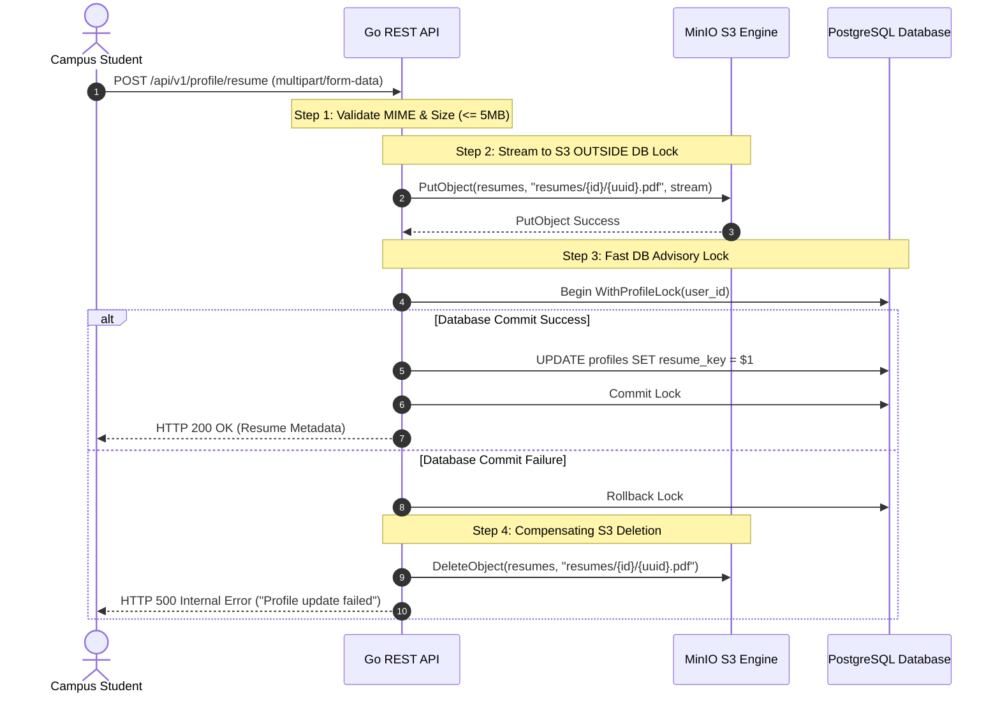

# Object Storage Architecture & MinIO Policies - Lynk

> **Authoritative Object Storage Specification**  
> **Storage Engine:** MinIO S3 (`lynk-minio` on ports `9000` API / `9001` Web Console)  
> **Scope:** Dedicated exclusively to student resumes (`resumes` bucket)  
> **Upload Boundary:** Streaming S3 decoupled from PostgreSQL transactions & advisory locks (F-02)  
> **Access Policy:** Private bucket with short-lived pre-signed download URLs (15-minute TTL)

---

## 1. Storage Invariants & Scope Boundary

Lynk enforces strict architectural boundaries separating relational state from binary file storage:

```
+--------------------------------------------------------+
|                   PostgreSQL 16                        |
|  Stores ONLY lightweight metadata:                     |
|  - resume_key: "resumes/st_usr_9a4f21e0/4c1b9f8d.pdf" |
|  - file_name, file_size, mime_type, uploaded_at        |
+--------------------------------------------------------+
                           ^
                           | Reference key only
                           v
+--------------------------------------------------------+
|                     MinIO S3                           |
|  Stores binary document payloads:                      |
|  - Bucket: "resumes" (private, no anonymous access)    |
|  - Object Key Pattern: "resumes/{user_id}/{uuid}.ext"  |
+--------------------------------------------------------+
```

### 1.1 Non-Negotiable Storage Rules
1. **Resumes Only:** MinIO in the MVP is dedicated strictly to student resumes. It must not be used for generic avatar hosting, static asset serving, or system logs.
2. **Zero Container Disk Persistence:** Resumes are never written to the local container or host filesystem. File uploads stream directly from the incoming HTTP multipart request body into MinIO via the AWS S3 Go SDK v2.
3. **No File Blobs in PostgreSQL:** PostgreSQL columns must never store `BYTEA` or binary blobs. Only S3 object keys are persisted in `profiles.resume_key` and `applications.resume_key`.
4. **Private by Default:** The `resumes` bucket is strictly private. Anonymous read/write access is blocked at the MinIO bucket policy level.

---

## 2. Bucket Provisioning & Initialization

The `resumes` bucket is provisioned automatically and idempotently during Go backend startup (`internal/storage/s3.go`):

```go
func NewS3Client(ctx context.Context, cfg Config) (*Client, error) {
    // 1. Initialize AWS SDK v2 S3 Client with MinIO endpoint resolver
    // 2. Probe bucket existence via HeadBucket
    _, err := client.s3.HeadBucket(ctx, &s3.HeadBucketInput{
        Bucket: aws.String(cfg.Bucket),
    })
    if err != nil {
        // 3. Auto-create bucket if missing
        _, err = client.s3.CreateBucket(ctx, &s3.CreateBucketInput{
            Bucket: aws.String(cfg.Bucket),
        })
    }
    return client, nil
}
```

### 2.1 Bucket Configuration Parameters
| Parameter | Value | Description |
| :--- | :--- | :--- |
| **Bucket Name** | `resumes` | Root storage namespace for all campus resumes |
| **Storage Class** | `STANDARD` | Default MinIO erasure-coded storage class |
| **Versioning** | Disabled | New uploads replace existing keys or generate unique UUIDs |
| **Access Policy** | Private (`private`) | Zero anonymous access; authenticated S3 credentials required |

---

## 3. Decoupled Upload Pipeline & Concurrency Safety (F-02, F-13)

### 3.1 The Problem: Advisory Lock Contention (F-02)
Prior to the Matrix Audit remediation, streaming file uploads into MinIO occurred *inside* a PostgreSQL advisory lock transaction (`WithProfileLock`). Under slow student network connections (e.g. uploading a 4MB PDF over campus Wi-Fi for 45 seconds), the database connection and advisory lock were held for the entire upload duration, exhausting the database connection pool and blocking other profile updates.

### 3.2 The Solution: External Streaming with Compensating Deletion
The upload pipeline in `internal/user/service.go` now completely decouples S3 network transfer from database transactions:



### 3.3 Compensating Deletion Invariant
If PostgreSQL fails to commit the new `resume_key` (e.g. database timeout, foreign key failure), the Go service immediately issues a compensating `DeleteObject` call to MinIO, guaranteeing that orphaned files never accumulate in the storage bucket.

### 3.4 Immutable Storage Client Injection (F-13)
The `storage.Client` is injected immutably into `user.NewService(userRepo, s3Client)` at server startup (`cmd/api/main.go`). Route handlers (`internal/user/resume_handler.go`) are strictly forbidden from mutating `h.service.storage` at runtime, completely eliminating data races under concurrent uploads.

---

## 4. Download & Retrieval Architecture

Resume documents are retrieved through two secure mechanisms depending on the caller context:

### 4.1 Pre-Signed URL Generation (Recommended for Web UI)
For viewing in the browser or downloading in the Next.js frontend, the Go API generates a short-lived pre-signed URL:
```go
func (c *Client) PresignGetURL(ctx context.Context, objectKey string, expiry time.Duration) (string, error) {
    presigner := s3.NewPresignClient(c.s3)
    req, err := presigner.PresignGetObject(ctx, &s3.GetObjectInput{
        Bucket: aws.String(c.bucket),
        Key:    aws.String(objectKey),
    }, s3.WithPresignExpires(expiry))
    return req.URL, err
}
```
- **TTL (Time to Live):** 15 minutes (`15 * time.Minute`).
- **Signature:** AWS Signature Version 4 (HMAC-SHA256).
- **Benefit:** Offloads binary streaming bandwidth from the Go API container directly to MinIO.

### 4.2 Authenticated Proxy Streaming Fallback
When callers access `GET /api/v1/profile/resume` directly, the Go backend verifies the active SuperTokens session and streams the object payload directly to the HTTP response with appropriate MIME headers:
```http
HTTP/1.1 200 OK
Content-Type: application/pdf
Content-Disposition: inline; filename="Student_Resume.pdf"
Content-Length: 184320
```

---

## 5. Security & Validation Rules

| Dimension | Rule | Enforcement Location | Failure Response |
| :--- | :--- | :--- | :--- |
| **Max File Size** | 5,242,880 bytes (`5MB`) | Handler (`http.MaxBytesReader`) | `413 Payload Too Large` |
| **Allowed File Types** | `application/pdf`, `.docx`, `.doc` | Service (MIME magic byte sniffing) | `400 Bad Request` |
| **Key Namespace** | `resumes/{user_id}/{uuid}.{ext}` | Service (Path construction) | Internal invariant |
| **Authorization Gate** | Verified `.edu` email required | `RequireVerifiedEmail` Middleware | `403 Forbidden` |
| **Orphan Prevention** | Compensating S3 delete on DB error | `internal/user/service.go` | Automated cleanup |
