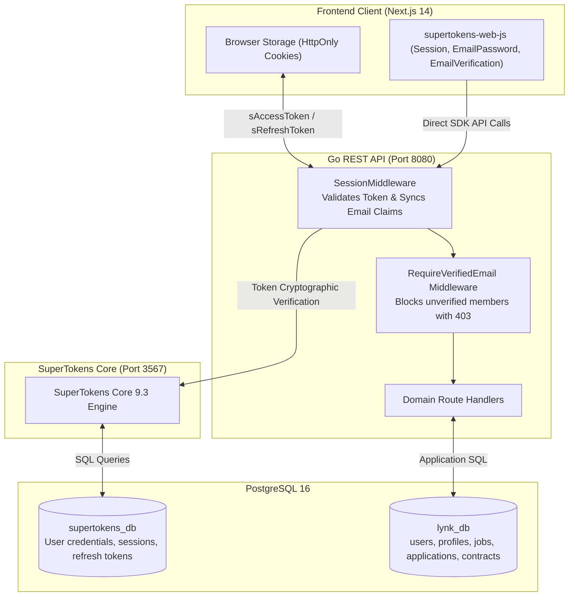
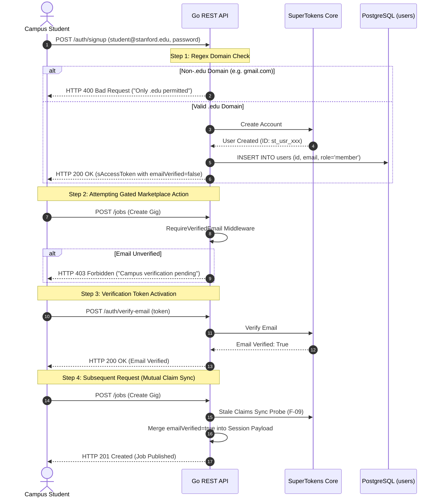

# Security, Threat Model, & IAM Architecture - Lynk

> **Authoritative Security & Identity Specification**  
> **Identity Engine:** Self-Hosted SuperTokens Core 9.3 (`lynk-supertokens` on port `3567`)  
> **Verification Gate:** Institutional `.edu` Domain Validation & Mandatory Email Activation  
> **Network Perimeter:** Strict CORS (`http://localhost:3000`), Anti-CSRF, and 1MB JSON Body Clamping  
> **Socket Protection:** 95s/100s TCP Timeout Envelopes exceeding 90s dynamic upload deadlines (F-05)

---

## 1. Identity & Access Management (IAM) Core Architecture

Lynk rejects commercial third-party auth SaaS vendors (Auth0, Clerk, Supabase) in favor of a completely self-hosted, sovereign identity engine powered by **SuperTokens Core** backed by PostgreSQL.



### 1.1 Dual-Cookie Session Mechanics
Authentication state is maintained through dual HttpOnly cookies:
1. **`sAccessToken`:** Short-lived access token (default: 1 hour) containing encrypted session claims (`userId`, `roles`, `emailVerified`).
2. **`sRefreshToken`:** Long-lived refresh token (default: 30 days) stored securely in `supertokens_db` enabling silent, rolling session renewal without prompting member credentials.
3. **Anti-CSRF Protection:** SuperTokens issues an anti-CSRF token on session creation, required on mutating write methods (`POST`, `PUT`, `DELETE`).

---

## 2. The Institutional `.edu` Verification Gate

To prevent fraud, impersonation, and untrusted accounts, Lynk enforces a multi-layered verification gate:



### 2.1 Server-Side Domain Enforcement
The Go backend intercepts the SuperTokens SignUp flow in `internal/auth/service.go`:
```go
const EduEmailRegex = `^[a-zA-Z0-9._%+-]+@[a-zA-Z0-9.-]+\.edu$`
```
Any attempt to register with a non-`.edu` email address is rejected at the API gateway prior to account creation in `supertokens_db`.

### 2.2 Mutual Stale Email Verification Synchronization (F-09)
A common distributed IAM failure occurs when a user verifies their email in another tab, but their existing access token still carries `emailVerified: false`.
- **Backend Sync:** In `internal/middleware/auth.go`, if `SessionMiddleware` detects `emailVerified == false` in the cached token payload, it performs a lightweight check against SuperTokens Core. If verified, it calls `sessionContainer.MergeIntoAccessTokenPayload` with `emailVerified: true`, upgrading the active session without forcing the user to log out.
- **Frontend Sync:** In `frontend/src/components/auth/AuthProvider.tsx`, `syncSession()` verifies token claims against the backend on window focus and route transitions.

---

## 3. Threat Model & Security Mitigations

### 3.1 Stored XSS via Protocol Injection (F-06)
- **Vulnerability:** Unsanitized user-supplied links in `profiles.portfolio_links` and `profiles.organization_website` could accept `javascript:` or `data:` pseudo-protocols, executing malicious code in the browser when clicked by employers.
- **Mitigation:** Strict URL scheme parsing and validation in both backend (`internal/user/service.go`) and frontend (`app/profile/page.tsx`):
  ```go
  func validateURLScheme(rawURL string) error {
      u, err := url.Parse(rawURL)
      if err != nil || (u.Scheme != "http" && u.Scheme != "https") {
          return ErrInvalidURLScheme
      }
      return nil
  }
  ```
- **Invariant:** Only `http://` and `https://` schemes are permitted. Any other scheme results in an immediate `400 Bad Request`.

### 3.2 Slowloris & TCP Upload Socket Drops (F-05)
- **Vulnerability:** Under slow network conditions on campus Wi-Fi, multi-megabyte resume uploads could take 30-60 seconds. Default Go server write timeouts (15s) dropped TCP connections mid-upload.
- **Mitigation:** Adjusted server HTTP socket timeouts in `cmd/api/main.go` to safely envelope the 90-second dynamic handler timeout:
  ```go
  srv := &http.Server{
      ReadTimeout:       95 * time.Second,  // Exceeds 90s resume upload timeout
      WriteTimeout:      100 * time.Second, // Allows response delivery after 90s handler
      ReadHeaderTimeout: 5 * time.Second,   // Mitigates Slowloris header attacks
      IdleTimeout:       60 * time.Second,  // Reclaims dead keep-alive sockets
  }
  ```

### 3.3 Denial-of-Service via Memory Exhaustion
- **1MB Global JSON Body Clamping:** `http.MaxBytesReader` clamps all non-multipart JSON endpoints to 1,048,576 bytes (`1MB`), instantly returning `413 Payload Too Large` if an attacker posts unbounded JSON bodies.
- **5MB Resume Upload Limit:** Resume uploads enforce an upper bound of `5 * 1024 * 1024` bytes (`5MB`).

### 3.4 Concurrency Race in Resume Storage (F-13)
- **Vulnerability:** Mutating `h.service.storage` inside HTTP request handlers caused race conditions under concurrent resume uploads.
- **Mitigation:** Injected immutable `storage.Client` directly into the `user.Service` constructor at application bootstrap (`user.NewService(userRepo, s3Client)`). Runtime handler mutations are eliminated.

### 3.5 Role-Based Authorization & Claims Structure (F-27)
Campus member roles are strictly encapsulated in `internal/auth/claims.go`:
```go
type UserClaims struct {
    UserID        string   `json:"sub"`
    Email         string   `json:"email"`
    Roles         []string `json:"roles"`
    EmailVerified bool     `json:"emailVerified"`
}

func (c *UserClaims) HasRole(role string) bool {
    if c == nil {
        return false
    }
    return slices.Contains(c.Roles, role)
}
```

---

## 4. CORS, CSRF, & Network Perimeter Defense

### 4.1 CORS Policy Configuration
The backend strictly isolates browser access via `internal/middleware/cors.go`:
```go
cors.Options{
    AllowedOrigins:   []string{"http://localhost:3000"},
    AllowedMethods:   []string{"GET", "POST", "PUT", "DELETE", "OPTIONS"},
    AllowedHeaders:   []string{"Authorization", "Content-Type", "anti-csrf", "rid", "fdi-version"},
    ExposedHeaders:   []string{"anti-csrf", "front-token"},
    AllowCredentials: true,
    MaxAge:           300,
}
```

### 4.2 Security Headers Checklist
| Security Header | Value | Purpose |
| :--- | :--- | :--- |
| `X-Content-Type-Options` | `nosniff` | Prevents browser MIME-type sniffing |
| `X-Frame-Options` | `DENY` | Prevents clickjacking in iframes |
| `X-XSS-Protection` | `1; mode=block` | Enables legacy browser XSS filters |
| `Access-Control-Allow-Credentials` | `true` | Restricts credentials to explicit allowed origin |
| `X-Request-Id` | UUIDv4 | Tracing and audit correlation |
