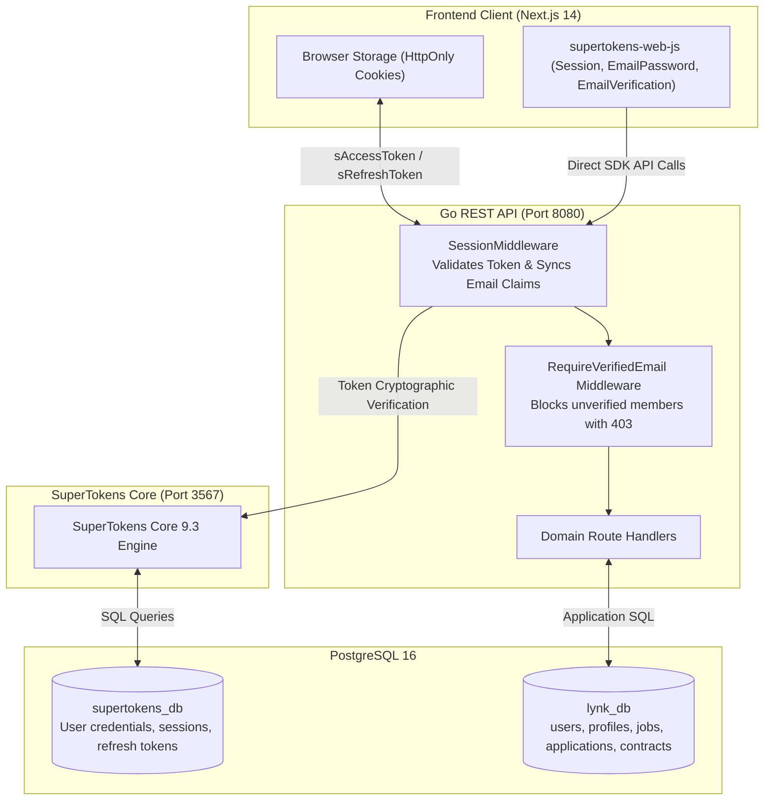
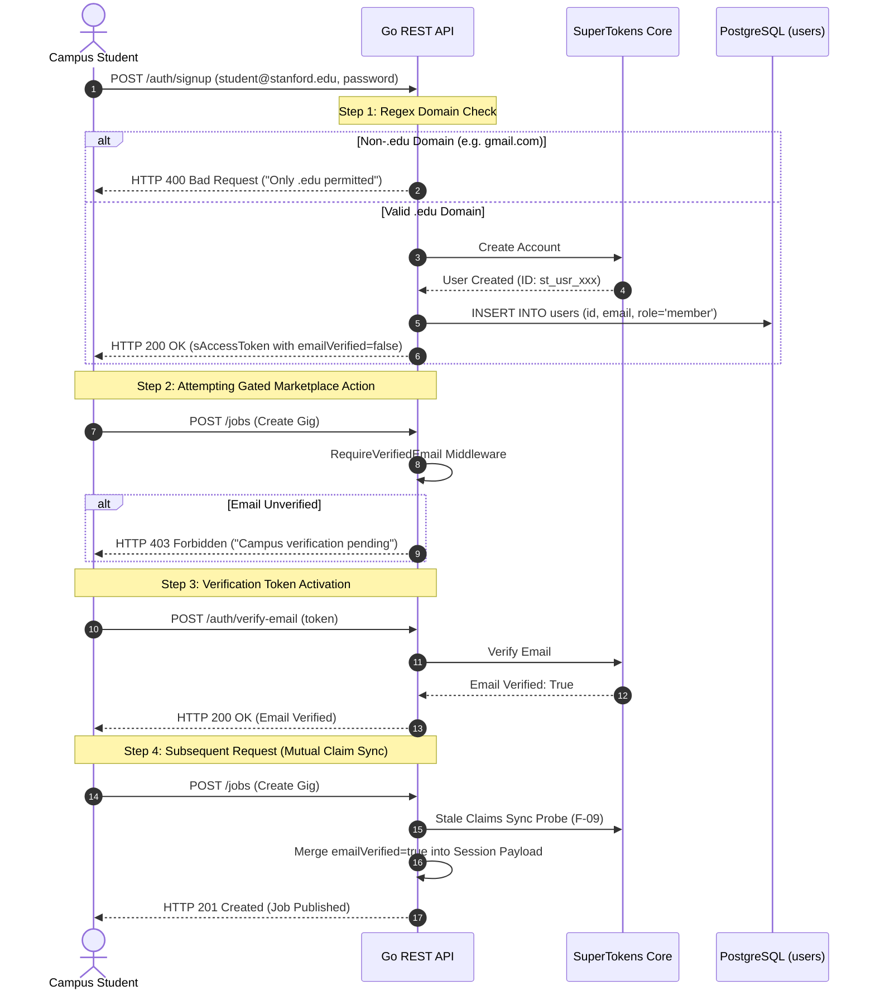
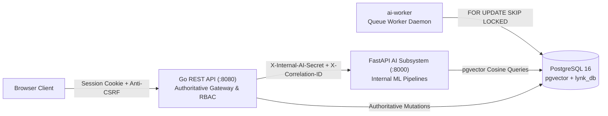

# Security, Threat Model, & IAM Architecture - Lynk

> **Authoritative Security & Identity Specification**  
> **Identity Engine:** Self-Hosted SuperTokens Core 9.3 (`lynk-supertokens` on port `3567`)  
> **Verification Gate:** Institutional `.edu` Domain Validation & Mandatory Email Activation  
> **Network Perimeter:** Strict CORS (`http://localhost:3000`), Anti-CSRF, and 1MB JSON Body Clamping  
> **Socket Protection:** 95s/100s TCP Timeout Envelopes exceeding 90s dynamic upload deadlines (F-05)

---

## 1. Identity & Access Management (IAM) Core Architecture

Lynk rejects commercial third-party auth SaaS vendors (Auth0, Clerk, Supabase) in favor of a completely self-hosted, sovereign identity engine powered by **SuperTokens Core** backed by PostgreSQL.



### 1.1 Dual-Cookie Session Mechanics
Authentication state is maintained through dual HttpOnly cookies:
1. **`sAccessToken`:** Short-lived access token (default: 1 hour) containing encrypted session claims (`userId`, `roles`, `emailVerified`).
2. **`sRefreshToken`:** Long-lived refresh token (default: 30 days) stored securely in `supertokens_db` enabling silent, rolling session renewal without prompting member credentials.
3. **Anti-CSRF Protection:** SuperTokens issues an anti-CSRF token on session creation, required on mutating write methods (`POST`, `PUT`, `DELETE`).

---

## 2. The Institutional `.edu` Verification Gate

To prevent fraud, impersonation, and untrusted accounts, Lynk enforces a multi-layered verification gate:



### 2.1 Server-Side Domain Enforcement
The Go backend intercepts the SuperTokens SignUp flow in `internal/auth/service.go`:
```go
const EduEmailRegex = `^[a-zA-Z0-9._%+-]+@[a-zA-Z0-9.-]+\.edu$`
```
Any attempt to register with a non-`.edu` email address is rejected at the API gateway prior to account creation in `supertokens_db`.

### 2.2 Mutual Stale Email Verification Synchronization (F-09)
A common distributed IAM failure occurs when a user verifies their email in another tab, but their existing access token still carries `emailVerified: false`.
- **Backend Sync:** In `internal/middleware/auth.go`, if `SessionMiddleware` detects `emailVerified == false` in the cached token payload, it performs a lightweight check against SuperTokens Core. If verified, it calls `sessionContainer.MergeIntoAccessTokenPayload` with `emailVerified: true`, upgrading the active session without forcing the user to log out.
- **Frontend Sync:** In `frontend/src/components/auth/AuthProvider.tsx`, `syncSession()` verifies token claims against the backend on window focus and route transitions.

---

## 3. Threat Model & Security Mitigations

### 3.1 Stored XSS via Protocol Injection (F-06)
- **Vulnerability:** Unsanitized user-supplied links in `profiles.portfolio_links` and `profiles.organization_website` could accept `javascript:` or `data:` pseudo-protocols, executing malicious code in the browser when clicked by employers.
- **Mitigation:** Strict URL scheme parsing and validation in both backend (`internal/user/service.go`) and frontend (`app/profile/page.tsx`):
  ```go
  func validateURLScheme(rawURL string) error {
      u, err := url.Parse(rawURL)
      if err != nil || (u.Scheme != "http" && u.Scheme != "https") {
          return ErrInvalidURLScheme
      }
      return nil
  }
  ```
- **Invariant:** Only `http://` and `https://` schemes are permitted. Any other scheme results in an immediate `400 Bad Request`.

### 3.2 Slowloris & TCP Upload Socket Drops (F-05)
- **Vulnerability:** Under slow network conditions on campus Wi-Fi, multi-megabyte resume uploads could take 30-60 seconds. Default Go server write timeouts (15s) dropped TCP connections mid-upload.
- **Mitigation:** Adjusted server HTTP socket timeouts in `cmd/api/main.go` to safely envelope the 90-second dynamic handler timeout:
  ```go
  srv := &http.Server{
      ReadTimeout:       95 * time.Second,  // Exceeds 90s resume upload timeout
      WriteTimeout:      100 * time.Second, // Allows response delivery after 90s handler
      ReadHeaderTimeout: 5 * time.Second,   // Mitigates Slowloris header attacks
      IdleTimeout:       60 * time.Second,  // Reclaims dead keep-alive sockets
  }
  ```

### 3.3 Denial-of-Service via Memory Exhaustion
- **1MB Global JSON Body Clamping:** `http.MaxBytesReader` clamps all non-multipart JSON endpoints to 1,048,576 bytes (`1MB`), instantly returning `413 Payload Too Large` if an attacker posts unbounded JSON bodies.
- **5MB Resume Upload Limit:** Resume uploads enforce an upper bound of `5 * 1024 * 1024` bytes (`5MB`).

### 3.4 Concurrency Race in Resume Storage (F-13)
- **Vulnerability:** Mutating `h.service.storage` inside HTTP request handlers caused race conditions under concurrent resume uploads.
- **Mitigation:** Injected immutable `storage.Client` directly into the `user.Service` constructor at application bootstrap (`user.NewService(userRepo, s3Client)`). Runtime handler mutations are eliminated.

### 3.5 Role-Based Authorization & Claims Structure (F-27)
Campus member roles are strictly encapsulated in `internal/auth/claims.go`:
```go
type UserClaims struct {
    UserID        string   `json:"sub"`
    Email         string   `json:"email"`
    Roles         []string `json:"roles"`
    EmailVerified bool     `json:"emailVerified"`
}

func (c *UserClaims) HasRole(role string) bool {
    if c == nil {
        return false
    }
    return slices.Contains(c.Roles, role)
}
```

---

## 4. CORS, CSRF, & Network Perimeter Defense

### 4.1 CORS Policy Configuration
The backend strictly isolates browser access via `internal/middleware/cors.go`:
```go
cors.Options{
    AllowedOrigins:   []string{"http://localhost:3000"},
    AllowedMethods:   []string{"GET", "POST", "PUT", "DELETE", "OPTIONS"},
    AllowedHeaders:   []string{"Authorization", "Content-Type", "anti-csrf", "rid", "fdi-version"},
    ExposedHeaders:   []string{"anti-csrf", "front-token"},
    AllowCredentials: true,
    MaxAge:           300,
}
```

### 4.2 Security Headers Checklist
| Security Header | Value | Purpose |
| :--- | :--- | :--- |
| `X-Content-Type-Options` | `nosniff` | Prevents browser MIME-type sniffing |
| `X-Frame-Options` | `DENY` | Prevents clickjacking in iframes |
| `X-XSS-Protection` | `1; mode=block` | Enables legacy browser XSS filters |
| `Access-Control-Allow-Credentials` | `true` | Restricts credentials to explicit allowed origin |
| `X-Request-Id` | UUIDv4 | Tracing and audit correlation |

---

## 5. First-Class AI Subsystem Security Architecture & Threat Model

The AI Subsystem introduces dedicated machine learning pipelines, embedding vector indexes, and generative inference capabilities while strictly preserving the Go backend as the authoritative application gateway.



### 5.1 Internal Service Isolation & Defense-in-Depth (`X-Internal-AI-Secret`)
- **Network Boundary:** The FastAPI AI backend (`ai-api:8000`) is deployed on the private Docker bridge network (`lynk-net`). Public browser clients communicate strictly through the Go backend (`:8080/api/v1/...`) and never invoke the AI service directly.
- **Header Authentication:** All `/internal/v1/*` routes in FastAPI enforce the `X-Internal-AI-Secret` header via `ai.app.middleware.auth.InternalAuthMiddleware`. Requests with missing or incorrect secrets are rejected with `HTTP 401 Unauthorized` before request parsing or pipeline execution.
- **Go AI Client Injection:** The Go backend securely injects the configured secret from `INTERNAL_AI_SECRET` into every outgoing HTTP request header.

### 5.2 Distributed Request Tracing (`X-Correlation-ID`)
- Every request entering the Go backend AI client either extracts the existing correlation ID from `ctx` or mints a new UUIDv4 injected as `X-Correlation-ID`.
- The FastAPI `CorrelationIdMiddleware` captures this header, binds it to contextual logs, and passes it into the `ai_runs` execution telemetry table.
- This provides unified audit trails across the Go orchestrator, Python inference pipeline, and database vector lookups.

### 5.3 Role-Based Access Control & Ownership Enforcement
The Go backend strictly enforces authorization boundaries prior to contacting internal AI services:
1. **Applicant Ranking (`GET /api/v1/jobs/{id}/applicants/ranking`):**
   - Requires active SuperTokens session (`HTTP 401` if unauthenticated).
   - Requires verified institutional `.edu` email (`HTTP 403` if unverified).
   - Enforces strict job creator ownership: `job.CreatedBy == claims.UserID`. Any third-party user or applicant attempting to inspect candidate rankings receives an immediate `HTTP 403 Forbidden`.
2. **People Search (`GET /api/v1/search/people`):**
   - Gated by active session and verified email (`HTTP 401/403`).
   - Prevents unauthenticated scraping or external harvesting of student profiles and skills.
3. **Generative Job Drafts (`POST /api/v1/jobs/generate`):**
   - Gated by active session and verified email.
   - Restricts generative model capacity consumption to verified campus members.
4. **Member Recommendations (`GET /api/v1/profile/recommendations`):**
   - Gated by active session and verified email. Recommendations are computed strictly for the authenticated caller's own profile.

### 5.4 Algorithmic Fairness & Non-Protected Attributes
Candidate scoring models must be fair, transparent, and legally defensible:
- **Observable Features Only:** The ranking pipeline (`ai/pipelines/ranking/ranker.py`) scores applicants based exclusively on three observable, merit-based dimensions:
  1. Canonical skill overlap (45% weight)
  2. Semantic embedding cosine similarity between job scope and cover letter / bio (35% weight)
  3. Academic department alignment (20% weight)
- **Protected Attribute Exclusion:** Demographic attributes (gender, race, ethnicity, age, graduation year) are strictly excluded from feature vectors, prompt templates, and scoring inputs.
- **Deterministic Parity:** Candidates with identical skill sets, department, and bio produce identical rank scores regardless of user identity.
- **Explainable Rationale:** Every advisory score includes transparent citations of matched skills, missing requirements, and component weight breakdowns.

### 5.5 Generative Sandboxing & Non-Mutation Invariant
- **Strict Pydantic Validation:** Generative draft responses from the LLM are parsed and validated through the `GeneratedJobDraft` Pydantic model (`ai/pipelines/drafts/generator.py`), validating fields, clamping string lengths, and enforcing type safety.
- **Non-Persistent Proposals:** The draft generation endpoint (`POST /api/v1/jobs/generate`) is strictly read-only with respect to the `jobs` database. It produces an ephemeral JSON draft returned to the client. The job is only created when the user reviews, edits, and explicitly submits `POST /api/v1/jobs`.
- **Offline Template Fallback:** If vLLM or external model inference is unavailable or produces unparseable JSON, the pipeline falls back to an offline rule-based heuristic template without crashing.

### 5.6 Graceful Degradation & Fault Domain Isolation
The platform guarantees that AI failure never compromises core business functionality:
- Every Go handler wrapping an AI pipeline includes deterministic SQL fallback logic.
- If `ai-api` is unresponsive, times out, or returns a 5xx error, the Go backend logs the failure, records telemetry, and returns standard database results with `HTTP 200 OK`.
- Core campus gig creation, applications, and contract completions remain operational even during total AI subsystem outages.

