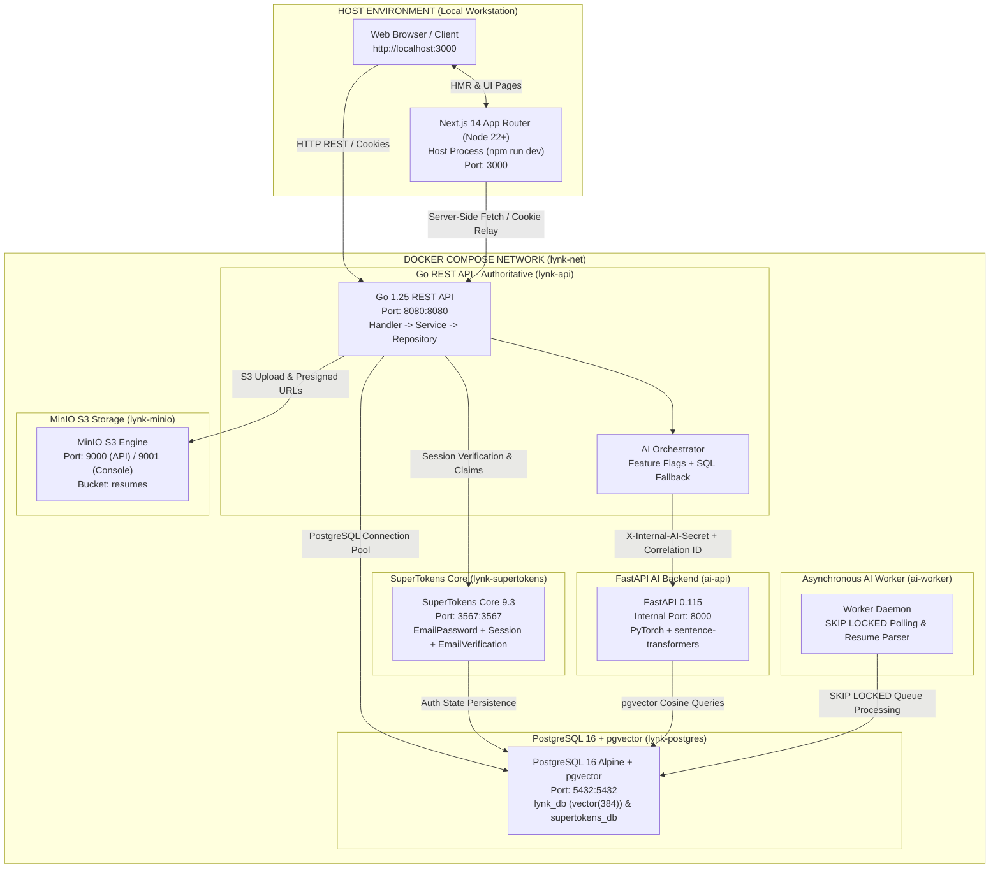
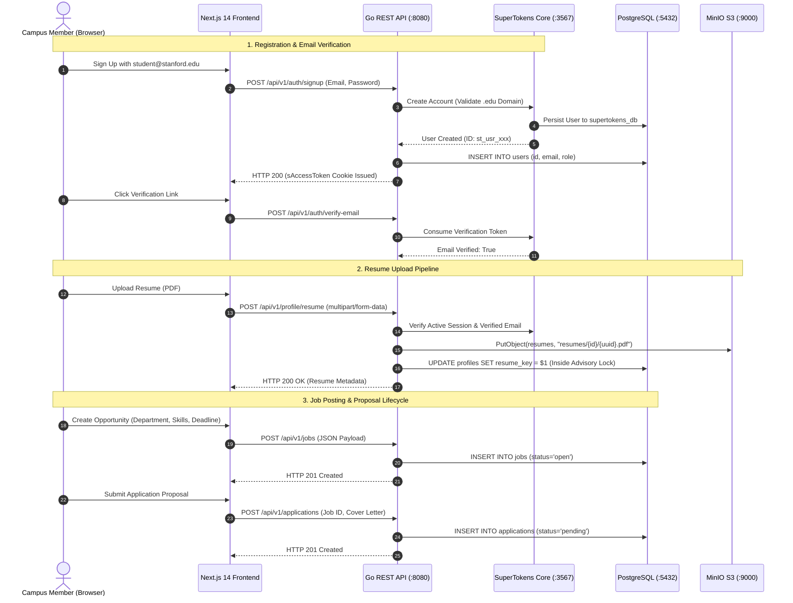
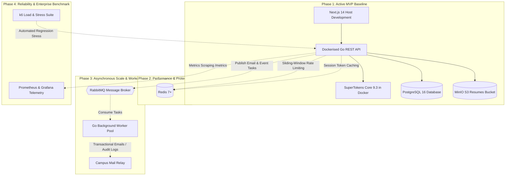

# System Architecture & Monorepo Topology - Lynk

> **Authoritative System Architecture Specification**  
> **Platform:** Lynk - High-Trust Campus Opportunity Discovery & Student Networking Platform  
> **Status:** Active Baseline (MVP Implementation)  
> **IAM Specification:** Self-Hosted SuperTokens Core 9.3 (`:3567`)  
> **Object Storage:** MinIO S3 (`:9000` API / `:9001` Web Console) - Exclusively for Resumes  
> **Container Boundary:** Docker Compose (`backend/`, PostgreSQL, SuperTokens Core, MinIO) + Host (`frontend/`)

---

## 1. Executive Summary & Core Thesis

**Lynk** is an institutional campus opportunity discovery and student networking platform engineered to connect verified university students, student founders, faculty, laboratories, and student organizations. Operating without payment handling, Lynk focuses purely on discovery, academic credentials, deliverable collaboration contracts, and peer reviews. By replacing the traditional fragmented dual-account model ("student" vs "employer") with a **Unified Campus Member** architecture, Lynk enables any campus participant to discover opportunities, collaborate on deliverables, and build verified academic reputations under a single verified academic profile.

### 1.1 Architectural Pillars
1. **Unified Campus Member Model:** Single user identity for all participants. Fluid transition between client and contributor capabilities with zero role switching or separate accounts.
2. **Institutional Email Verification Gate:** Registration is strictly restricted to institutional `.edu` domains. Critical marketplace actions (posting opportunities, submitting applications, uploading resumes, accepting contracts) are gated behind email verification.
3. **Self-Hosted IAM (SuperTokens Core):** Fully self-hosted identity engine running inside Docker Compose on port 3567. Manages session tokens (`sAccessToken`, `sRefreshToken`), credential hashing, and email verification.
4. **Dedicated Object Storage (MinIO S3):** Student resumes are stored exclusively in an S3-compatible MinIO bucket (`resumes`). The database persists only object keys and file metadata.
5. **Clean Layered Backend:** Go REST API following idiomatic `Handler -> Service -> Repository` separation with `pgx/v5` connection pooling.
6. **Decoupled Frontend Development:** Next.js 14 App Router executes directly on the developer's host machine (`npm run dev`) for instant Hot Module Replacement (HMR), proxying API requests to the Dockerised Go backend.

---

## 2. Containerization & Runtime Topology

The Lynk architecture strictly enforces a containerization boundary between persistent infrastructure and the frontend development environment.



### 2.1 Port Allocation Matrix

| Service | Container Name | Host Port | Internal Port | Protocol | Purpose |
| :--- | :--- | :--- | :--- | :--- | :--- |
| **Frontend** | *Host Process* | `3000` | N/A | HTTP | Next.js 14 App Router (React 18, TypeScript, Tailwind) |
| **Go REST API** | `lynk-api` | `8080` | `8080` | HTTP | Authoritative Go HTTP service (Chi router, endpoints) |
| **FastAPI AI Backend** | `ai-api` | N/A (Internal) | `8000` | HTTP | Internal ML/embedding/ranking service (`X-Internal-AI-Secret`) |
| **AI Worker Daemon** | `ai-worker` | N/A | N/A | Background | Concurrent queue worker (`FOR UPDATE SKIP LOCKED`) |
| **SuperTokens Core** | `lynk-supertokens` | `3567` | `3567` | HTTP | Self-hosted IAM engine & session verifier |
| **PostgreSQL + pgvector** | `lynk-postgres` | `5432` | `5432` | TCP | Relational & 384-dim vector storage (`lynk_db`, `supertokens_db`) |
| **MinIO S3 API** | `lynk-minio` | `9000` | `9000` | HTTP/S3 | AWS S3 v4 compatible object storage for student resumes |
| **MinIO Web Console** | `lynk-minio` | `9001` | `9001` | HTTP | Storage management web user interface |

---

## 3. Layered Go Backend Architecture

The backend (`backend/`) avoids bloated enterprise frameworks in favor of Go standard library idioms and the lightweight Chi router (`v5`).

```
                    HTTP Request (:8080)
                             |
                             v
+--------------------------------------------------------+
|                   Middleware Pipeline                  |
|  RequestID -> RealIP -> Logger -> Recoverer -> CORS        |
|  -> 1MB Body Limit -> SessionMiddleware -> EmailGate      |
+----------------------------+---------------------------+
                             |
                             v
+--------------------------------------------------------+
|                      Handler Layer                     |
|  - Decode JSON / multipart request payloads            |
|  - Validate schema bounds (e.g. 5,000-char job desc)   |
|  - Map domain errors to HTTP status codes              |
|  - Render standardized JSON envelopes                  |
+----------------------------+---------------------------+
                             |
                             v
+--------------------------------------------------------+
|                      Service Layer                     |
|  - Business logic & state machine invariants           |
|  - Calendar-day deadline normalization                 |
|  - S3 streaming outside DB locks (compensating deletes)|
|  - URL scheme sanitization (HTTP/HTTPS only)           |
+----------------------------+---------------------------+
                             |
                             v
+--------------------------------------------------------+
|                    Repository Layer                    |
|  - Raw parameterized SQL via pgx/v5 connection pool   |
|  - Transaction isolation (pgx.Tx)                      |
|  - Deadlock-free lock ordering (jobs -> apps -> contracts|
|  - Safe application restoration on cancellation        |
+----------------------------+---------------------------+
                             |
                             v
                    PostgreSQL 16 Database
```

### 3.1 Layer Responsibilities & Boundaries

1. **Middleware (`internal/middleware/`):**
   - `SessionMiddleware`: Validates incoming `sAccessToken` via SuperTokens Core SDK. Synchronizes stale email verification claims dynamically into the access token payload (F-09).
   - `RequireVerifiedEmail`: Enforces the campus verification gate, blocking unverified accounts with `403 Forbidden` (`{"error": "Campus verification pending"}`).
   - `CORS`: Restricts access to trusted frontend origin (`http://localhost:3000`) with explicit header whitelisting and credentials transmission.
   - `MaxBodyBytes`: Enforces a strict 1MB limit on JSON endpoints to prevent memory exhaustion attacks.
2. **Handlers (`internal/<domain>/`):**
   - Strictly responsible for HTTP deserialization, input bounds validation, and HTTP response encoding. Zero direct database queries or S3 API calls.
3. **Services (`internal/<domain>/`):**
   - Contains all business rules, domain invariants, and external coordinator logic.
   - Example: Decoupled S3 resume uploads from PostgreSQL advisory locks (`WithProfileLock`), executing S3 streaming first and running compensating deletions on database commit failure (F-02, F-13).
4. **Repositories (`internal/<domain>/`):**
   - Manages relational queries using raw SQL. Strictly encapsulates transaction management (`pgx.Tx`), row scanning, and row-level locking (`SELECT ... FOR UPDATE`).
5. **AI Orchestrator (`internal/ai/orchestrator/`):**
   - Sits alongside domain services. Encapsulates HTTP client calls to the internal FastAPI service (`http://ai-api:8000`), injects `X-Internal-AI-Secret` and `X-Correlation-ID`, manages feature flags, and executes bounded retries with jitter.
   - Invariant: Implements graceful degradation fallbacks to SQL/heuristic logic whenever the AI backend is disabled or unreachable.

---

## 4. First-Class AI Subsystem & Orchestration Architecture

The AI subsystem in Lynk is engineered as an internal platform capability preserving the Go backend as the authoritative boundary.

### 4.1 Authority Boundary & Defense-in-Depth
- **Authority Invariant:** The Go REST API (`:8080`) is the sole public-facing service. The FastAPI AI backend (`:8000`) is bound exclusively to `lynk-net` and rejects requests lacking `X-Internal-AI-Secret`.
- **Non-Mutation Invariant:** Generative AI endpoints return draft payloads; they never execute database mutations on authoritative domain tables (`jobs`, `applications`, `contracts`).
- **Telemetry Parity:** Every pipeline execution invokes `track_ai_run` recording feature name, model/prompt/pipeline versions, SHA-256 input hash, output JSON, and wall-clock latency in `ai_runs`.

### 4.2 Dense Semantic Memory & Vector Search (pgvector)
- **Embedding Model:** `all-MiniLM-L6-v2` generating 384-dimensional dense vectors normalized to unit length.
- **Index Structure:** PostgreSQL 16 `vector(384)` indexed with Hierarchical Navigable Small World (`HNSW`) cosine distance metric (`vector_cosine_ops`).
- **Unique Invariant:** `ai_embeddings` enforces `UNIQUE(entity_type, entity_id, embedding_type, model_name, model_version)` ensuring idempotent re-indexing.

### 4.3 Asynchronous Queue Processing (`ai-worker`)
- **Queue Table:** `ai_jobs` table storing job type, entity ID, JSONB payload, status (`pending`, `processing`, `completed`, `failed`, `dead_letter`), attempt counters, and backoff timestamps.
- **Concurrency Law:** The `ai-worker` daemon claims jobs using `SELECT ... FOR UPDATE SKIP LOCKED`, preventing worker race conditions across concurrent containers.
- **Backoff & Recovery:** Failures calculate exponential backoff stored in `payload->>'retry_at'` (`power(2, attempts + 1) * INTERVAL '1 second'`). Once `max_attempts` is reached, jobs transition safely to `dead_letter`.

---

## 5. End-to-End Data Flow & Request Lifecycle



---

## 6. Evolutionary Architecture Roadmap

Lynk starts with a synchronous, self-contained architecture and evolves incrementally across four well-defined phases.



### Phase Descriptions
- **Phase 1 (Active MVP):** Synchronous Go API, self-hosted SuperTokens Core, PostgreSQL 16, MinIO S3, Next.js host frontend. Zero queues, zero distributed caches.
- **Phase 2 (Performance & Protection):** Introduces Redis for rate limiting (leaky bucket algorithm) on public endpoints and caching resolved sessions.
- **Phase 3 (Async Processing & Workers):** Introduces RabbitMQ and Go worker pools for background email delivery, PDF parsing, and event logging.
- **Phase 4 (Enterprise & Scale):** Introduces k6 automated benchmarking, Prometheus metrics scraping, and Grafana dashboards for production monitoring.
