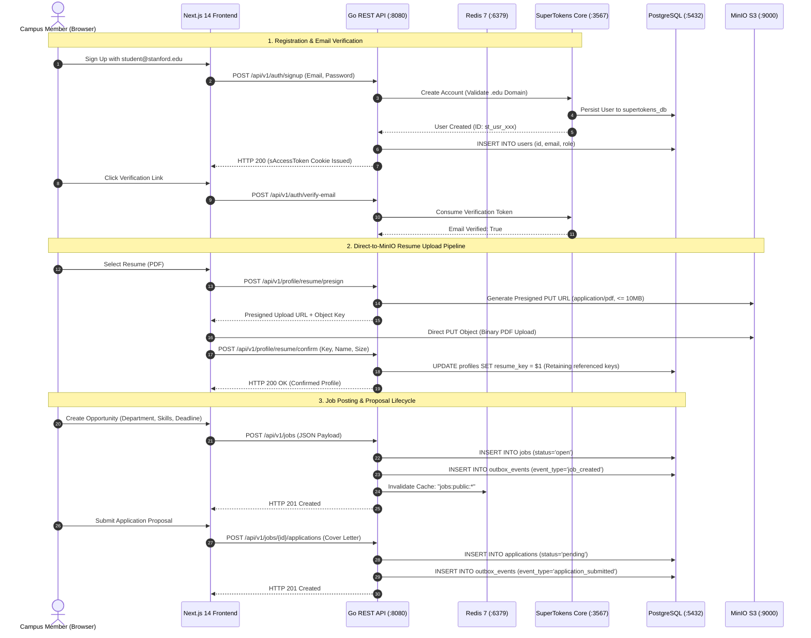
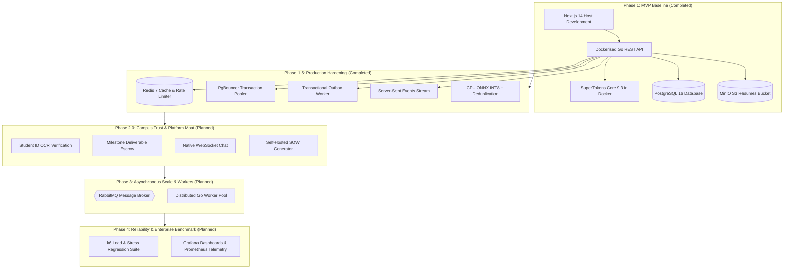

# System Architecture & Monorepo Topology - Lynk

> **Authoritative System Architecture Specification**  
> **Platform:** Lynk - Campus work and student freelance platform  
> **Status:** Active Baseline (Phase 1 MVP & Phase 1.5 Production Hardening Complete)  
> **IAM Specification:** Self-Hosted SuperTokens Core 9.3 (`:3567`)  
> **Object Storage:** MinIO S3 (`:9000` API / `:9001` Web Console) - Exclusively for Resumes  
> **Caching & Rate Limiting:** Redis 7+ (`:6379`)  
> **Connection Pooling:** PgBouncer (`:6432`) in transaction pooling mode  
> **Container Boundary:** Docker Compose (`backend/`, PostgreSQL, PgBouncer, Redis, SuperTokens Core, MinIO, FastAPI AI, AI Worker) + Host (`frontend/`)

---

## 1. Executive Summary & Core Thesis

**Lynk** is an institutional campus work platform connecting verified university students with projects, deliverable agreements, and peer reviews. Operating without payment handling, Lynk focuses purely on discovery, academic credentials, deliverable collaboration contracts, and peer reviews. By replacing the traditional fragmented dual-account model ("student" vs "employer") with a **Unified Campus Member** architecture, Lynk enables any campus participant to discover opportunities, collaborate on deliverables, and build verified academic reputations under a single verified academic profile.

### 1.1 Architectural Pillars
1. **Unified Campus Member Model:** Single user identity for all participants. Fluid transition between client and contributor capabilities with zero role switching or separate accounts.
2. **Institutional Email Verification Gate:** Registration is strictly restricted to institutional `.edu` domains. Critical marketplace actions (posting opportunities, submitting applications, uploading resumes, accepting contracts) are gated behind email verification.
3. **Self-Hosted IAM (SuperTokens Core):** Fully self-hosted identity engine running inside Docker Compose on port 3567. Manages session tokens (`sAccessToken`, `sRefreshToken`), credential hashing, and email verification.
4. **Dedicated Object Storage (MinIO S3):** Student resumes are stored exclusively in an S3-compatible MinIO bucket (`resumes`) via direct pre-signed upload URLs and secure download streaming.
5. **Clean Layered Backend:** Go REST API following idiomatic `Handler -> Service -> Repository` separation with `pgx/v5` connection pooling, Redis sliding-window rate limiting, cache-aside layer, transactional outbox worker, and real-time SSE stream.
6. **Decoupled Frontend Development:** Next.js 14 App Router executes directly on the developer's host machine (`npm run dev`) for instant Hot Module Replacement (HMR), backed by TanStack Query for cache synchronization and optimistic UI updates.

---

## 2. Containerization & Runtime Topology

The Lynk architecture strictly enforces a containerization boundary between persistent infrastructure and the frontend development environment.

```mermaid
flowchart TB
    subgraph Host["HOST ENVIRONMENT (Local Workstation)"]
        Browser["Web Browser / Client<br/>http://localhost:3000"]
        NextHost["Next.js 14 App Router (Node 22+)<br/>Host Process (npm run dev)<br/>Port: 3000 (TanStack Query + SSE)"]
        Browser <-->|HMR & UI Pages| NextHost
    end

    subgraph DockerBridge["DOCKER COMPOSE NETWORK (lynk-net)"]
        subgraph APIService["Go REST API - Authoritative (lynk-api)"]
            GoAPI["Go 1.25 REST API<br/>Port: 8080:8080<br/>Handler -> Service -> Repository<br/>Outbox Worker + SSE Broker"]
            Orchestrator["AI Orchestrator<br/>Feature Flags + SQL Fallback"]
            GoAPI --> Orchestrator
        end

        subgraph RedisService["Redis 7 (lynk-redis)"]
            Redis["Redis 7 Cache & Rate Limiting<br/>Port: 6379:6379<br/>Sliding-Window Counter & Cache-Aside"]
        end

        subgraph AIService["FastAPI AI Backend (ai-api)"]
            FastAPI["FastAPI 0.115<br/>Internal Port: 8000<br/>CPU ONNX INT8 + SHA-256 Cache"]
        end

        subgraph WorkerService["Asynchronous AI Worker (ai-worker)"]
            AIWorker["Worker Daemon<br/>SKIP LOCKED Polling & Resume Parser"]
        end

        subgraph IAMService["SuperTokens Core (lynk-supertokens)"]
            ST["SuperTokens Core 9.3<br/>Port: 3567:3567<br/>EmailPassword + Session + EmailVerification"]
        end

        subgraph PoolService["PgBouncer Connection Pooler (lynk-pgbouncer)"]
            PGB["PgBouncer 1.22<br/>Port: 6432:6432<br/>Transaction Pooling Mode"]
        end

        subgraph DBService["PostgreSQL 16 + pgvector (lynk-postgres)"]
            PG["PostgreSQL 16 Alpine + pgvector<br/>Port: 5432:5432<br/>lynk_db (vector(384)) & supertokens_db"]
        end

        subgraph StorageService["MinIO S3 Storage (lynk-minio)"]
            MinIO["MinIO S3 Engine<br/>Port: 9000 (API) / 9001 (Console)<br/>Bucket: resumes"]
        end
    end

    %% Network Connections
    Browser -->|HTTP REST / SSE Stream / Cookies| GoAPI
    NextHost -->|Server-Side Fetch / Cookie Relay| GoAPI
    GoAPI -->|Rate Limiting & Cache-Aside| Redis
    GoAPI -->|Session Verification & Claims| ST
    GoAPI -->|Pooled Queries (:6432)| PGB
    PGB -->|Transaction Connections| PG
    ST -->|Auth State Persistence| PG
    GoAPI -->|Direct Presigned S3 URLs| MinIO
    Orchestrator -->|X-Internal-AI-Secret + Correlation ID| FastAPI
    FastAPI -->|pgvector Cosine Queries| PG
    AIWorker -->|SKIP LOCKED Queue Processing| PG
```

### 2.1 Port Allocation Matrix

| Service | Container Name | Host Port | Internal Port | Protocol | Purpose |
| :--- | :--- | :--- | :--- | :--- | :--- |
| **Frontend** | *Host Process* | `3000` | N/A | HTTP | Next.js 14 App Router (React 18, TypeScript, Tailwind, TanStack Query) |
| **Go REST API** | `lynk-api` | `8080` | `8080` | HTTP | Authoritative Go HTTP service (Chi router, SSE stream, `/metrics`) |
| **Redis 7** | `lynk-redis` | `6379` | `6379` | TCP | Sliding-window rate limiter & high-throughput cache-aside store |
| **PgBouncer** | `lynk-pgbouncer` | `6432` | `6432` | TCP | PostgreSQL transaction connection pooling |
| **FastAPI AI Backend** | `ai-api` | N/A (Internal) | `8000` | HTTP | Internal ML/embedding service (CPU ONNX INT8, `X-Internal-AI-Secret`) |
| **AI Worker Daemon** | `ai-worker` | N/A | N/A | Background | Concurrent queue worker (`FOR UPDATE SKIP LOCKED`) |
| **SuperTokens Core** | `lynk-supertokens` | `3567` | `3567` | HTTP | Self-hosted IAM engine & session verifier |
| **PostgreSQL + pgvector** | `lynk-postgres` | `5432` | `5432` | TCP | Relational & 384-dim vector storage (`lynk_db`, `supertokens_db`) |
| **MinIO S3 API** | `lynk-minio` | `9000` | `9000` | HTTP/S3 | AWS S3 v4 compatible object storage for student resumes |
| **MinIO Web Console** | `lynk-minio` | `9001` | `9001` | HTTP | Storage management web user interface |

---

## 3. Layered Go Backend Architecture

The backend (`backend/`) avoids bloated enterprise frameworks in favor of Go standard library idioms and the lightweight Chi router (`v5`).

```
                    HTTP Request (:8080)
                             |
                             v
+--------------------------------------------------------+
|                   Middleware Pipeline                  |
|  RequestID -> RealIP -> Logger -> Recoverer -> CORS    |
|  -> Metrics -> SlidingWindowRateLimiter -> 1MB Limit   |
|  -> SessionMiddleware -> RequireVerifiedEmail          |
+----------------------------+---------------------------+
                             |
                             v
+--------------------------------------------------------+
|                      Handler Layer                     |
|  - Decode JSON / multipart request payloads            |
|  - Validate schema bounds (e.g. 5,000-char job desc)   |
|  - Input Sanitization (microcosm-cc/bluemonday)        |
|  - Map domain errors to HTTP status codes              |
|  - Render standardized JSON envelopes                  |
+----------------------------+---------------------------+
                             |
                             v
+--------------------------------------------------------+
|                      Service Layer                     |
|  - Business logic & state machine invariants           |
|  - Cache-Aside reading (Redis / In-Memory fallback)    |
|  - Transactional Outbox Event publishing               |
|  - SSE Broker notification dispatching                 |
|  - Calendar-day deadline normalization                 |
|  - S3 presigned upload & download streaming            |
|  - URL scheme sanitization (HTTP/HTTPS only)           |
+----------------------------+---------------------------+
                             |
                             v
+--------------------------------------------------------+
|                    Repository Layer                    |
|  - Parameterized SQL via pgx/v5 (PgBouncer :6432 pool) |
|  - Transaction isolation (pgx.Tx)                      |
|  - Deadlock-free lock ordering (jobs -> apps -> contr) |
|  - Safe application restoration on cancellation        |
|  - Referenced resume retention checking                |
+----------------------------+---------------------------+
                             |
                             v
            PostgreSQL 16 Database + pgvector
```

### 3.1 Layer Responsibilities & Boundaries

1. **Middleware (`internal/middleware/`):**
   - `SessionMiddleware`: Validates incoming `sAccessToken` via SuperTokens Core SDK. Synchronizes stale email verification claims dynamically into the access token payload (F-09).
   - `RequireVerifiedEmail`: Enforces the campus verification gate, blocking unverified accounts with `403 Forbidden` (`{"error": "Campus verification pending"}`).
   - `SlidingWindowRateLimiter`: Sliding-window rate limiter (`internal/ratelimit`) backed by Redis (or in-memory store) enforcing per-IP quotas (e.g., 120 req/min).
   - `Metrics`: Prometheus metrics collector (`internal/metrics`) tracking HTTP request durations and status codes (`GET /metrics`).
   - `CORS`: Restricts access to trusted frontend origin (`http://localhost:3000`) with explicit header whitelisting and credentials transmission.
   - `MaxBodyBytes`: Enforces a strict 1MB limit on JSON endpoints to prevent memory exhaustion attacks.
2. **Handlers (`internal/<domain>/`):**
   - Strictly responsible for HTTP deserialization, input bounds validation, HTML/XSS sanitization, and HTTP response encoding. Zero direct database queries or S3 API calls.
3. **Services (`internal/<domain>/`):**
   - Contains all business rules, domain invariants, cache-aside orchestration, and external coordinator logic.
   - Example: Decoupled S3 resume uploads from PostgreSQL advisory locks (`WithProfileLock`), executing S3 streaming first and retaining referenced resumes on profile updates.
4. **Repositories (`internal/<domain>/`):**
   - Manages relational queries using raw parameterized SQL. Strictly encapsulates transaction management (`pgx.Tx`), row scanning, and lock hierarchies.
5. **Transactional Outbox Worker (`internal/outbox/`):**
   - Background worker polling `outbox_events` with `SELECT ... FOR UPDATE SKIP LOCKED` and dispatching domain events (`application_submitted`, `contract_status_changed`, `review_created`) to SSE broker and event handlers with exponential retry backoff.
6. **Server-Sent Events Broker (`internal/sse/`):**
   - In-memory event broker delivering real-time notification streams to authenticated frontend clients via `GET /api/v1/events/stream`.
7. **AI Orchestrator (`internal/ai/orchestrator/`):**
   - Encapsulates HTTP client calls to the internal FastAPI service (`http://ai-api:8000`), injects `X-Internal-AI-Secret` and `X-Correlation-ID`, manages feature flags, and executes bounded retries with jitter and graceful SQL fallbacks.

---

## 4. First-Class AI Subsystem & Orchestration Architecture

The AI subsystem in Lynk is engineered as an internal platform capability preserving the Go backend as the authoritative boundary.

### 4.1 Authority Boundary & Defense-in-Depth
- **Authority Invariant:** The Go REST API (`:8080`) is the sole public-facing service. The FastAPI AI backend (`:8000`) is bound exclusively to `lynk-net` and rejects requests lacking `X-Internal-AI-Secret`.
- **Non-Mutation Invariant:** Generative AI endpoints return draft payloads; they never execute database mutations on authoritative domain tables (`jobs`, `applications`, `contracts`).
- **Telemetry Parity:** Every pipeline execution invokes `track_ai_run` recording feature name, model/prompt/pipeline versions, SHA-256 input hash, output JSON, and wall-clock latency in `ai_runs`.

### 4.2 Dense Semantic Memory & Vector Search (pgvector + CPU ONNX)
- **Embedding Model:** `all-MiniLM-L6-v2` generating 384-dimensional dense vectors normalized to unit length, optimized with INT8 ONNX quantization for CPU inference (< 300MB RAM, 18-25ms latency).
- **Deduplication Cache:** `embedding_cache` table keyed by `(content_hash, model_name)` storing pre-computed vectors to skip redundant inference.
- **Index Structure:** PostgreSQL 16 `vector(384)` indexed with Hierarchical Navigable Small World (`HNSW`) cosine distance metric (`vector_cosine_ops`).
- **Unique Invariant:** `ai_embeddings` enforces `UNIQUE(entity_type, entity_id, embedding_type, model_name, model_version)` ensuring idempotent re-indexing.

### 4.3 Asynchronous Queue Processing (`ai-worker`)
- **Queue Table:** `ai_jobs` table storing job type, entity ID, JSONB payload, status (`pending`, `processing`, `completed`, `failed`, `dead_letter`), attempt counters, and backoff timestamps.
- **Concurrency Law:** The `ai-worker` daemon claims jobs using `SELECT ... FOR UPDATE SKIP LOCKED`, preventing worker race conditions across concurrent containers.
- **Backoff & Recovery:** Failures calculate exponential backoff stored in `payload->>'retry_at'` (`power(2, attempts + 1) * INTERVAL '1 second'`). Once `max_attempts` is reached, jobs transition safely to `dead_letter`.

---

## 5. End-to-End Data Flow & Request Lifecycle


```mermaid
sequenceDiagram
    autonumber
    actor User as Campus Member (Browser)
    participant FE as Next.js 14 Frontend
    participant API as Go REST API (:8080)
    participant Redis as Redis 7 (:6379)
    participant ST as SuperTokens Core (:3567)
    participant DB as PostgreSQL (:5432)
    participant S3 as MinIO S3 (:9000)

    Note over User,ST: 1. Registration & Email Verification
    User->>FE: Sign Up with student@stanford.edu
    FE->>API: POST /api/v1/auth/signup (Email, Password)
    API->>ST: Create Account (Validate .edu Domain)
    ST->>DB: Persist User to supertokens_db
    ST-->>API: User Created (ID: st_usr_xxx)
    API->>DB: INSERT INTO users (id, email, role)
    API-->>FE: HTTP 200 (sAccessToken Cookie Issued)
    User->>FE: Click Verification Link
    FE->>API: POST /api/v1/auth/verify-email
    API->>ST: Consume Verification Token
    ST-->>API: Email Verified: True

    Note over User,S3: 2. Direct-to-MinIO Resume Upload Pipeline
    User->>FE: Select Resume (PDF)
    FE->>API: POST /api/v1/profile/resume/presign
    API->>S3: Generate Presigned PUT URL (application/pdf, <= 10MB)
    API-->>FE: Presigned Upload URL + Object Key
    FE->>S3: Direct PUT Object (Binary PDF Upload)
    FE->>API: POST /api/v1/profile/resume/confirm (Key, Name, Size)
    API->>DB: UPDATE profiles SET resume_key = $1 (Retaining referenced keys)
    API-->>FE: HTTP 200 OK (Confirmed Profile)

    Note over User,DB: 3. Job Posting & Proposal Lifecycle
    User->>FE: Create Opportunity (Department, Skills, Deadline)
    FE->>API: POST /api/v1/jobs (JSON Payload)
    API->>DB: INSERT INTO jobs (status='open')
    API->>DB: INSERT INTO outbox_events (event_type='job_created')
    API->>Redis: Invalidate Cache: "jobs:public:*"
    API-->>FE: HTTP 201 Created

    User->>FE: Submit Application Proposal
    FE->>API: POST /api/v1/jobs/{id}/applications (Cover Letter)
    API->>DB: INSERT INTO applications (status='pending')
    API->>DB: INSERT INTO outbox_events (event_type='application_submitted')
    API-->>FE: HTTP 201 Created
```

---

## 6. Evolutionary Architecture Roadmap

Lynk progresses across structured phases balancing rapid delivery with production-grade reliability.


```mermaid
flowchart TD
    subgraph Phase1["Phase 1: MVP Baseline (Completed)"]
        direction TB
        P1_FE[Next.js 14 Host Development]
        P1_API[Dockerised Go REST API]
        P1_ST[SuperTokens Core 9.3 in Docker]
        P1_PG[(PostgreSQL 16 Database)]
        P1_S3[(MinIO S3 Resumes Bucket)]
        P1_FE --> P1_API
        P1_API --> P1_ST
        P1_API --> P1_PG
        P1_API --> P1_S3
    end

    subgraph Phase1_5["Phase 1.5: Production Hardening (Completed)"]
        direction TB
        P15_REDIS[(Redis 7 Cache & Rate Limiter)]
        P15_PGB[PgBouncer Transaction Pooler]
        P15_OUTBOX[Transactional Outbox Worker]
        P15_SSE[Server-Sent Events Stream]
        P15_ONNX[CPU ONNX INT8 + Deduplication]
        P1_API --> P15_REDIS
        P1_API --> P15_PGB
        P1_API --> P15_OUTBOX
        P1_API --> P15_SSE
    end

    subgraph Phase2["Phase 2.0: Campus Trust & Platform Moat (Planned)"]
        direction TB
        P2_OCR[Student ID OCR Verification]
        P2_ESCROW[Milestone Deliverable Escrow]
        P2_WS[Native WebSocket Chat]
        P2_LLM[Self-Hosted SOW Generator]
    end

    subgraph Phase3["Phase 3: Asynchronous Scale & Workers (Planned)"]
        direction TB
        P3_RMQ{{RabbitMQ Message Broker}}
        P3_WORKER[Distributed Go Worker Pool]
    end

    subgraph Phase4["Phase 4: Reliability & Enterprise Benchmark (Planned)"]
        direction TB
        P4_K6[k6 Load & Stress Regression Suite]
        P4_OBS[Grafana Dashboards & Prometheus Telemetry]
    end

    Phase1 --> Phase1_5
    Phase1_5 --> Phase2
    Phase2 --> Phase3
    Phase3 --> Phase4
```

### Phase Descriptions
- **Phase 1 (MVP Baseline - Completed):** Synchronous Go API, self-hosted SuperTokens Core, PostgreSQL 16, MinIO S3, Next.js host frontend.
- **Phase 1.5 (Production Hardening - Completed):** Redis 7 sliding-window rate limiting, Redis cache-aside layer, Transactional Outbox pattern & worker, Server-Sent Events realtime stream, PgBouncer transaction pooling, CPU ONNX INT8 AI embeddings with SHA-256 deduplication cache, Prometheus `/metrics` endpoint.
- **Phase 2.0 (Campus Work Platform - Planned):** Student ID OCR verification, milestone deliverable escrow, multi-campus tenancy, WebSockets, SOW generator, FERPA compliance shield.
- **Phase 3 (Async Processing & Workers - Planned):** RabbitMQ message broker and distributed worker pools for heavy background asynchronous tasks.
- **Phase 4 (Enterprise & Scale - Planned):** Continuous k6 load regression automation and production Grafana telemetry.
