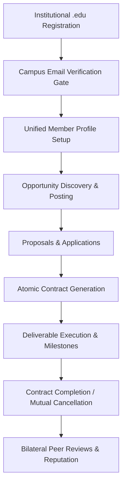

# Lynk Platform Features & Capabilities Specification

> **Authoritative Technical Feature Specification for Lynk**  
> **Platform Version:** MVP Baseline  
> **Architectural Topology:** Unified Campus Member Identity, Go REST API, Next.js 14 Frontend, PostgreSQL 16, SuperTokens Core 9.3, MinIO S3

---

## 1. Executive Platform Overview

**Lynk** is an institutional campus work platform connecting verified university students with projects, deliverable agreements, and peer reviews. Operating as a discovery-first network without payment handling, Lynk facilitates peer collaboration, deliverable agreements, and verified reputation building.

### The Problem Lynk Solves
1. **Commercial Marketplace Friction:** Traditional freelance platforms impose financial processing, escrow fees, and commercial transactional overhead on students seeking academic, research, or peer-to-peer projects.
2. **Account Silos:** Typical platforms force users to choose between rigid "client" and "freelancer" account types, whereas students frequently post opportunities (e.g., club webmaster, research assistant, hackathon teammate) while simultaneously applying for others.
3. **Identity & Trust Deficit:** Open web platforms suffer from spam, credential fraud, and unverified actors. Lynk mandates institutional `.edu` authentication before any marketplace interactions can occur.

---

## 2. Core Architectural Pillars

### 2.1 The Unified Campus Member Model
Lynk eliminates the dual-account paradigm in favor of the **Unified Campus Member** model:
- **Single Identity, Dual Capabilities:** Every authenticated member has one account. A member can create and manage opportunities (as an organizer/poster) and discover and apply to opportunities (as a contributor/student).
- **Academic Context First:** Profiles highlight major, academic department, graduation cohort year, technical skills, and club/laboratory affiliations alongside professional links.
- **Reputation Attached to Identity:** Reviews and contract history accumulate on the single member profile regardless of whether they acted as poster or contributor.

### 2.2 The Zero-Payment Discovery Model
- Lynk handles **no payments, credit cards, bank accounts, or monetary transactions**.
- Postings define deliverable requirements, scope, academic department, and timelines.
- Contracts track milestones and deliverables rather than financial balances.

---

## 3. Comprehensive Feature Breakdown

---

### Feature 1: Authentication & Institutional Access Control (IAM)

| Capability | Technical Mechanism | User Experience |
| :--- | :--- | :--- |
| **Strict `.edu` Domain Validation Gate** | Enforced at registration by SuperTokens pre-signup hooks and Go backend validators (`isEduEmail`). | Users attempting to register with commercial email providers (e.g., `@gmail.com`, `@yahoo.com`) are immediately rejected with an explanatory message. |
| **Self-Hosted SuperTokens Core** | Dedicated containerized IAM engine running SuperTokens Core 9.3 on port 3567 (`EmailPassword`, `Session`, `EmailVerification` recipes). | Enterprise-grade credential management, password hashing, and session rotation without third-party cloud SaaS dependencies. |
| **Mandatory Email Verification Gate** | Custom middleware (`RequireVerifiedEmail`) checks the session claim `st-ev`. Rejects unverified writes with HTTP 403 `EMAIL_NOT_VERIFIED`. | Unverified users can browse public jobs, but cannot post jobs, apply to jobs, or upload resumes until confirming their university inbox. |
| **Dual Session Transport** | Supports HttpOnly `sAccessToken` / `sRefreshToken` cookies and explicit `Authorization: Bearer <token>` headers (`st-auth-mode: header`). | Seamless support for both browser Next.js clients and headless automated CLI / test clients. |
| **Identity Synchronization** | `POST /api/v1/auth/sync` idempotently maps SuperTokens authentication identity to the application's PostgreSQL `users` and `profiles` records. | Profile initialization occurs smoothly without race conditions or orphan user rows. |

---

### Feature 2: Unified Campus Member Profiles

| Capability | Technical Mechanism | User Experience |
| :--- | :--- | :--- |
| **Academic Identity** | Stored in PostgreSQL `profiles` table: First Name, Last Name, Bio, Department, Graduation Year. | Clean profile showcasing academic standing, expected graduation cohort, and personal summary. |
| **Skills Taxonomy** | PostgreSQL `text[]` array with pre-configured popular academic and engineering tags (React, Python, Go, Machine Learning, UI/UX, etc.). | Clickable pill tags with autocomplete and quick-select presets for instant profile enrichment. |
| **Campus Organization Links** | Dedicated `organization` and `organization_website` fields with strict URL format validation (`http://` or `https://`). | Students representing campus clubs, student government, or university laboratories can display verified organization affiliations. |
| **External Portfolios** | PostgreSQL `text[]` array storing validated external URLs (GitHub, personal portfolio, LinkedIn). | Counterparties can inspect live code samples and design portfolios directly from application cards. |
| **Single-Page Editing** | Next.js App Router (`/profile`) with optimistic UI updates and validation feedback. | Edit bio, department, skills, and affiliations in one centralized management view. |

---

### Feature 3: Secure Resume Storage & Presigned S3 Access

| Capability | Technical Mechanism | User Experience |
| :--- | :--- | :--- |
| **MinIO S3 Object Storage** | Dedicated MinIO S3 container (`resumes` bucket) on ports 9000/9001. | Scalable, S3-compatible binary asset storage completely isolated from application database rows. |
| **Direct Stream Uploads** | Multipart form-data uploaded via Go API (`POST /api/v1/profile/resume`) with MIME type validation (PDF, DOCX) and 5MB size ceiling. | One-click drag-and-drop file upload with live progress and size validation. |
| **Presigned URL Retrieval** | Go API issues time-limited AWS SDK S3 presigned URLs (15-minute expiration) with public authority host rewriting. | Resumes are never exposed via public URLs. File links expire automatically after access. |
| **Contextual Authorization** | Only the resume owner or verified organizers reviewing active applications can request presigned resume download links. | Complete student privacy; unauthorized third parties cannot scrape or access student resumes. |

---

### Feature 4: Campus Opportunity (Job) Discovery & Management

| Capability | Technical Mechanism | User Experience |
| :--- | :--- | :--- |
| **Opportunity Creation** | `POST /api/v1/jobs` with Title, Description, Academic Department, Required Skills, and Optional Deadline. | Verified members can post campus projects, research roles, hackathon teammate requests, or club tasks. |
| **State Machine Lifecycle** | Enforces strict status progression: `open` -> `in_progress` -> `closed` (or `cancelled`). | Postings clearly indicate whether they are actively seeking contributors, currently being executed, or completed. |
| **Search & Multi-Faceted Filters** | Real-time SQL query builder filtering by search keywords (title/description), department, and required skill tags. | Live search with debounced inputs and instant filter pill tags. |
| **Opportunity Detail View** | Next.js `/jobs/[id]` route providing comprehensive task description, deadline countdown, creator info, and application CTA. | Rich editorial presentation detailing prerequisites, timeline expectations, and poster credentials. |
| **Applicant Counter** | Relational count queries aggregating applications per posting. | Organizers can monitor applicant counts at a glance from their dashboard and posting lists. |

---

### Feature 5: Applications & Proposal Management

| Capability | Technical Mechanism | User Experience |
| :--- | :--- | :--- |
| **Proposal Submission** | `POST /api/v1/jobs/{id}/applications` requiring cover letter and automatically linking profile resume. | Students pitch their qualifications, availability, and interest with a single click. |
| **Duplicate Prevention** | Relational `UNIQUE (job_id, applicant_id)` constraint in PostgreSQL. | Prevents duplicate proposal spam; students can only submit one active application per posting. |
| **Verification Gate** | Gate middleware rejects application attempts from unverified email accounts (HTTP 403). | Protects opportunity posters from anonymous or non-student proposals. |
| **Organizer Review Dashboard** | Next.js `/jobs/[id]/applicants` interface allowing posters to filter applicants by `all`, `pending`, `accepted`, or `rejected`. | Dedicated candidate management board with quick access to student profiles, cover letters, and resumes. |
| **Application Decisioning** | Posters can individually accept or reject candidate proposals. | Clear feedback loop for student applicants; status updates reflect immediately in candidate dashboards. |

---

### Feature 6: Deliverable Collaboration Contracts

| Capability | Technical Mechanism | User Experience |
| :--- | :--- | :--- |
| **Atomic Contract Generation** | `AcceptApplicationTx` executes a multi-step PostgreSQL transaction: accepts target application, rejects other pending candidates, sets job to `in_progress`, and creates active `Contract`. | One-click candidate selection immediately establishes a formal collaboration agreement with zero orphaned states. |
| **Deadlock-Free Lock Ordering** | Strict deterministic lock hierarchy (`jobs` -> `applications` -> `contracts`) utilizing `SELECT ... FOR UPDATE`. | Completely prevents race conditions or database deadlocks during high-concurrency accept/cancel operations. |
| **Contract State Machine** | Supported transitions: `active` -> `completed` or `active` -> `cancelled`. | Immutable audit trail tracking when work started (`started_at`) and when deliverable completed (`completed_at`). |
| **Mutual Cancellation & Reopening** | Contract cancellation automatically reopens parent job to `open` and restores previously rejected candidates back to `pending`. | If a peer collaboration falls through, organizers do not lose their pool of applicants and can immediately select another contributor. |
| **Deliverable Completion Gate** | Only the opportunity organizer/client can mark a contract as `completed`, which automatically transitions the parent job to `closed`. | Guarantees contributors cannot prematurely close out projects without organizer sign-off. |

---

### Feature 7: Bilateral Peer Reviews & Reputation

| Capability | Technical Mechanism | User Experience |
| :--- | :--- | :--- |
| **Double-Sided Reviews** | Both organizer and contributor can submit reviews once contract reaches `completed` status. | 360-degree accountability reflecting communication, quality of deliverables, and collaboration. |
| **Numerical & Qualitative Feedback** | Rating scale (1 to 5 stars) paired with structured written commentary (`POST /api/v1/contracts/{id}/reviews`). | Meaningful peer feedback that rewards reliable contributors and high-quality organizers. |
| **Duplicate Conflict Prevention** | Unique composite constraint `UNIQUE (contract_id, reviewer_id)` returning HTTP 409 `DUPLICATE_REVIEW`. | Eliminates vote stuffing or duplicate review submissions. |
| **Reputation Integration** | SQL joins between `reviews`, `users`, and `profiles` aggregate average ratings and review counts on member profiles. | High-trust campus credentials; members build a verified track record visible across future applications. |

---

### Feature 8: Activity Feed & Centralized Hub

| Capability | Technical Mechanism | User Experience |
| :--- | :--- | :--- |
| **Unified Activity Center** | `/activity` aggregating a member's posted opportunities, submitted applications, active contracts, and completed reviews. | Single operational dashboard for tracking all ongoing collaborations across both roles. |
| **Semantic Status Indicators** | Visual badge components with distinct color tokens (emerald for active/open, sky for in-progress, amber for pending, rose for cancelled/rejected). | Instant visual clarity regarding project status and required next actions. |
| **Responsive Dark & Light Themes** | Native Tailwind CSS dark mode utilizing CSS variables and modern contrast hierarchy. | Accessible, high-contrast reading experience across desktop and mobile devices. |

---

### Feature 9: AI-Powered Job Description Draft Generator

| Capability | Technical Mechanism | User Experience |
| :--- | :--- | :--- |
| **Idea-to-Draft Conversion** | `POST /api/v1/jobs/generate` accepts a rough concept and academic department, synthesizing structured title, requirements, and tags via OpenAI-compatible vLLM. | Campus organizers type a brief project idea and instantly receive a well-structured, professional job posting draft. |
| **Strict Schema Validation** | Pydantic v2 structured outputs validated against versioned prompt template `job-draft-v1`. | Guaranteed valid JSON containing title, description, department, and required skills array. |
| **Temperature Backoff & Heuristic Fallback** | Dynamic temperature backoff (0.2 -> 0.0) on parse failure; resilient offline heuristic fallback if model server is unreachable. | High availability: drafts always generate with HTTP 200 without ever throwing 500 errors to the client. |
| **Authoritative Non-Mutation Invariant** | Endpoint produces transient draft response payloads only; never directly creates rows in the authoritative `jobs` table. | Posters retain 100% human-in-the-loop control, reviewing and adjusting the draft before manually publishing. |

---

### Feature 10: Hybrid Semantic & Keyword Search

| Capability | Technical Mechanism | User Experience |
| :--- | :--- | :--- |
| **Dual-Domain Discovery** | `GET /api/v1/search/jobs?q=...` (public) and `GET /api/v1/search/people?q=...` (verified session). | Search for both campus gig opportunities and peer students with specific skills or academic backgrounds. |
| **Reciprocal Rank Fusion (RRF)** | Blends PostgreSQL full-text search (`to_tsquery('english', ...)`), canonical skill tag matching, and pgvector cosine distance (`<=>`). | Natural language queries (e.g. "student experienced in distributed systems and backend Go") surface highly relevant results even without exact keyword matches. |
| **Graceful SQL Degradation** | If the AI service or vector index is offline, the Go orchestrator automatically falls back to keyword-based SQL search with HTTP 200. | Zero user-visible downtime during model updates or GPU restarts. |
| **Student Privacy Protection** | People search strictly requires an active session and verified `.edu` email address (HTTP 401/403 for unauthorized requests). | Prevents external scrapers or unverified users from indexing the campus student directory. |

---

### Feature 11: Advisory AI Candidate Ranking & Explainability

| Capability | Technical Mechanism | User Experience |
| :--- | :--- | :--- |
| **Advisory Applicant Scoring** | `GET /api/v1/jobs/{id}/applicants/ranking` evaluates candidates on a 0 to 100 composite score. | Opportunity posters can triage large applicant pools with transparent, data-driven ranking recommendations. |
| **Multi-Feature Observable Weighting** | Weighted scoring: 45% canonical skill overlap, 35% semantic embedding similarity (bio & proposal vs. job description), 20% department compatibility. | Transparent score explanations clearly itemizing matched skills, missing skills, and observable weight breakdown. |
| **Strict Algorithmic Fairness** | Protected demographic attributes (gender, race, age, graduation year, ethnicity) are strictly excluded from all features and scoring. | Fair, unbiased student evaluation anchored purely on observable technical competence and task prerequisites. |
| **Creator-Only Authorization** | Gated strictly to the job creator (`job.CreatedBy == claims.UserID`). Third parties and other applicants receive HTTP 403 Forbidden. | Complete applicant privacy; competitors cannot see rankings or competing proposals. |

---

### Feature 12: Intelligent Member Recommendations Engine

| Capability | Technical Mechanism | User Experience |
| :--- | :--- | :--- |
| **Skill Co-occurrence Graph** | `GET /api/v1/profile/recommendations` computes co-occurrence relationships (e.g., Python + ML -> PyTorch; React + TS -> Next.js, Tailwind). | Suggests natural skill adjacencies that students can learn or add to enhance profile discoverability. |
| **Deduplication Invariant** | Engine strictly filters out skills the member already possesses. | Recommendations are always fresh and additive. |
| **Profile Completeness Auditing** | Detects missing bios, empty portfolio links, or sparse skill lists with clear, actionable advice. | Students receive guidance on how to make their campus profile stand out to opportunity organizers. |

---

### Feature 13: Hybrid Moderation & Spam Detection

| Capability | Technical Mechanism | User Experience |
| :--- | :--- | :--- |
| **Near-Duplicate Detection** | Vector cosine distance comparison (< 0.05 / > 0.95 similarity) against existing jobs posted by the same user. | Flags repetitive or spam postings automatically before they clutter the campus feed. |
| **Velocity & Low-Info Anomaly Signals** | Flags posting bursts (>= 5 posts in 1h window) and short content (<= 30 characters). | Protects the campus marketplace from automated bots and low-quality submissions. |
| **Audit Logging** | Persists decisions and risk scores to `moderation_events` table for platform review. | Transparent audit trail ensuring platform integrity. |

---

### Feature 14: Aspect-Based Review Insights & Reputation

| Capability | Technical Mechanism | User Experience |
| :--- | :--- | :--- |
| **Aspect Decomposition** | `GET /api/v1/users/{id}/ai-insights` analyzes written review text across three dimensions: Technical Ability, Communication, and Timeliness. | Members and organizers gain granular insight into a peer's collaborative strengths beyond simple 1-5 star averages. |
| **Recurring Pattern Detection** | Highlights positive traits when validated across 3 or more independent completed contracts (`is_recurring: true`). | Distinguishes consistent high performers from one-off reviews. |

---

### Feature 15: Campus Skill Demand Analytics & Statistical Forecasting

| Capability | Technical Mechanism | User Experience |
| :--- | :--- | :--- |
| **Demand Snapshots** | `GET /api/v1/analytics/skills` aggregates campus opportunity posting trends, active job counts, and unique organizer demand ratios. | Students can discover which technical skills and disciplines are actively sought after on campus. |
| **Statistical Forecasting** | Least-squares linear regression trend analysis and moving averages (strictly avoiding LLM hallucination for mathematical calculations). | Provides growth trajectory predictions (growing, stable, declining) to guide student skill acquisition. |

---

### Feature 16: Asynchronous Worker Queue & Vector Embedding Pipeline

| Capability | Technical Mechanism | User Experience |
| :--- | :--- | :--- |
| **SKIP LOCKED Concurrency** | Dedicated `ai-worker` daemon polls `ai_jobs` using PostgreSQL `FOR UPDATE SKIP LOCKED`. | Multiple worker containers process jobs concurrently without duplicate execution or deadlocks. |
| **Exponential Retry Backoff** | Failed jobs schedule retries with exponential backoff stored in `payload->>'retry_at'`, transitioning to `dead_letter` upon reaching `max_attempts`. | Transient database or network blips recover gracefully without hammering internal services. |
| **Background Resume Parsing** | Extracts canonical campus skills from uploaded student resumes (`source: "ai_resume_parser"`). | Automates profile enrichment upon resume upload. |

---

## 4. Role & Permissions Matrix

| Platform Action | Unauthenticated Visitor | Unverified Member | Verified Student | Verified Organizer | Platform Admin |
| :--- | :---: | :---: | :---: | :---: | :---: |
| **Browse Open Opportunities** | Yes | Yes | Yes | Yes | Yes |
| **View Opportunity Details** | Yes | Yes | Yes | Yes | Yes |
| **Search & Filter Opportunities (SQL)** | Yes | Yes | Yes | Yes | Yes |
| **Hybrid Semantic Job Search** | Yes | Yes | Yes | Yes | Yes |
| **Hybrid Semantic People Search** | No (401) | No (403) | Yes | Yes | Yes |
| **Skill Demand Analytics** | Yes | Yes | Yes | Yes | Yes |
| **View Member AI Insights** | Yes | Yes | Yes | Yes | Yes |
| **Register Account (`.edu` only)** | Yes | -- | -- | -- | -- |
| **Verify Institutional Email** | -- | Yes | -- | -- | -- |
| **Edit Personal Profile** | No | Yes | Yes | Yes | Yes |
| **View Personal AI Recommendations** | No | No (403) | Yes | Yes | Yes |
| **Upload / Download Own Resume** | No | No (403) | Yes | Yes | Yes |
| **Generate AI Job Draft** | No | No (403) | Yes | Yes | Yes |
| **Create Opportunity Posting** | No | No (403) | Yes | Yes | Yes |
| **Submit Proposal / Application** | No | No (403) | Yes | Yes | Yes |
| **View Received Proposals** | No | No | Owner Only | Owner Only | Yes |
| **View AI Candidate Ranking** | No | No | No | Creator Only (403) | Yes |
| **Download Applicant Resume** | No | No | No | Authorized Owner | Yes |
| **Accept / Reject Proposals** | No | No | No | Authorized Owner | Yes |
| **View Active Contract** | No | No | Participant | Participant | Yes |
| **Cancel Active Contract** | No | No | Participant | Participant | Yes |
| **Mark Contract Completed** | No | No | No | Client / Poster Only | Yes |
| **Submit Peer Review** | No | No | Participant | Participant | Yes |

---

## 5. Non-Functional & Reliability Highlights

1. **Deterministic Database Migrations:** 12 raw forward and rollback SQL migrations (`000001` through `000012`) including `pgvector` vector extension and 12 AI subsystem tables.
2. **Layered Go Architecture:** Clean separation of concerns (`Handler` -> `Service` -> `Repository`) with standard library routing and `pgx/v5` connection pooling.
3. **Internal AI Microservice & Secret Defense:** FastAPI backend operates on internal Docker network (`lynk-net`) requiring `X-Internal-AI-Secret`. Zero direct public exposure.
4. **Comprehensive Graceful Degradation:** Every AI endpoint falls back to deterministic SQL logic with HTTP 200 if the AI backend is unreachable.
5. **Multi-Stage Containerization:** Production-ready Dockerfiles for both Go backend (`backend/Dockerfile`) and Python AI subsystem (`ai/Dockerfile`) with non-root security.
6. **Automated End-to-End Testing:** Complete 14-phase integration test suite (`scripts/smoke-test.sh` and `scripts/smoke-test.ps1`) verifying all core and AI lifecycle transitions against running infrastructure.
7. **Offline Evaluation Benchmarks:** Built-in information retrieval evaluation harness (`ai/evaluation/`) measuring NDCG@K, MRR, Precision@K, and F1 score against curated ground-truth datasets.
8. **CI/CD Quality Gates:** Automated verification of Go unit tests, Python AI test suite (100 tests), frontend TypeScript typecheck, ESLint, database rollback checks, container builds, and full-stack smoke tests.
